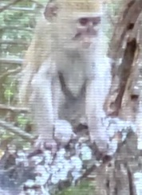

# Botswana Blog

## Days 3-6 (safari)
Greetings from the Okavango Delta! We are currently on our last day of safari and have been seeing incredible wildlife during game drives, cooking with the skilled gourmet chefs in the kitchen, and learning about Botswana’s culture. We have been blown away by the amazing hospitality that we have been received with at the safari, from the head chef Siya expertly meeting all our dietary needs, to our guide Piet sharing stories from his culture and teaching us about the animals on game drives. In our down time, we have been rehearsing our presentations for our three-day FLL camp which we will host in Maun in a couple days. On our last day, to help practice and share, we had the opportunity to work with the staff members at the camp and teach them a little about FLL while we waited for our plane to arrive. We are so grateful to be able to experience such an abundant and beautiful ecosystem, and learn from extremely skilled staff. Below are some photos and stories we heard and encountered during our stay.

### Stories*:
We asked one of the guides, Tizzar, how he became so knowledgeable about the land and wildlife, and he explained that from the age of six, he tended to his family's free-range goats, and would need to follow each member of the herd all throughout the day. On a hot day, he and his cousin were out with the goats. They fell asleep when the goats stopped to rest and woke up to find they were gone! Losing his family's goats would have been disastrous, and this was the first time he and his cousin had to track animals, with no one having taught him about the land or how to navigate it. He eventually tracked them all the way home, no goat casualties! Tizzar told us that he learned about the wildlife through all his experiences growing up in rural Botswana, but that kids today are more disconnected from nature due to technology. Hearing about this helped put into perspective how dependent on technology and sheltered our childhoods have been. This in comparison to someone who is so in tune with the intricacies of the natural world where they can distinguish between 50 different goat kids and match them to each of their mothers (that's Tizzar!). (Kaitlin wrote this!)

Piet, our safari guide, shared a cultural concept in Botswana about the relationship between twins. They say that the younger twin pushes the older twin out of the womb to meet the sun. It is then believed that the younger twin is the protector of the older one. This explains the shield that each twin has for each other and how they both always have each other’s backs. We, Sawar and Sanj, relate to this as twins, and how we have love for each other for eternity. (Guess who wrote this!)

Our guide, Piet, showed us one of the only baobab trees in the area (there are only two!). He explained how it is the biggest tree in Africa and how it can grow to an incredible 60 square meters at the base. He told us about how the tree can grow for hundreds of years, and how the inside layers will eventually dry out and create a hollow space inside the tree. There was even a tree so large it was used as a prison a long time ago. (Ollie wrote this!)

When we spotted a herd of zebras, our guide Piet told us that the national animal of Botswana is the zebra. He explained how a politician from Botswana traveled to Britain to study abroad. In the royal court he got to know the princess and they got married. At the time, interracial marriage was considered unacceptable. However they later made Botswana an independent country in 1966 and chose the zebra as the national animal since their black and white stripes represent the end of apartheid in southern Africa and people living in peace regardless of their race. (Brianna wrote this!)

 **(please note that some of these may be inaccurate due to poor short term memory)*

### Animal encounters:
There was a buffalo kill by a coalition of four lions (three male, one female).

    
The other lion. Content warning: The image is fairly graphic.

    

We had elephants in the camp! (not these ones though, it was at night and we didn’t take photos 😢)

We were blessed with two honey badger encounters. This picture is of one that we watched hunt successfully and eat!

Secretary bird (Ollie just really likes this bird). It was very skittish and apparently people come from all over to see this bird. Not particularly rare, but a really cool sight as it gives velociraptor vibes.

Lilac-breasted roller!

Encountered hyenas when they were trying to get at the food the lions above had captured

Hippos are quite scary up close but when at a distance can be a sight to see

#### Honorary mentions:

- Porcupine: got to see it for a few seconds in the daylight (they are nocturnal) before it ran away. Our guide hadn’t seen one for over 4 months, so this was a big deal.

- Wild dogs: these guys were really far away so we didn’t get any good photos but they are really great runners and have a distinct c sharp call to regroup their pack

## Days 1-3 (6/26 – 6/28) (it really feels like one long day though)
Dumela! We have experienced four different countries, four international airports, three different plane manufacturers, and many accents in 48 hours (pretty much, we’re rounding!). Despite these exciting adventures, here are our top three things we’re excited to have a break from: cramped spaces, airplane food, and sleeping sitting up (or just getting no sleep). Things we’re excited about are: eating more cultural food (Sawar), meeting new people (Sanj), cultural exchange (Kaitlin), seeing cool animals (Brianna), seeing the sunrise (Ollie), sharing STEM (Guinness). When we finally landed in Maun, we were kindly picked up by a member of the Tshilli Farm who drove us 45 minutes (after patiently waiting for us to figure out luggage out) to the farm where we’re staying. During the drive, so many kids who were walking home from their school day waved and shouted to greet us. Everyone has been incredibly welcoming and hospitable, and we’ve only gotten a taste of Botswana. We will be updating this blog as frequently as we can and you’ll next be hearing about our safari adventures!

.jpeg>)
.jpg>)
.jpg>)
.jpg>)

