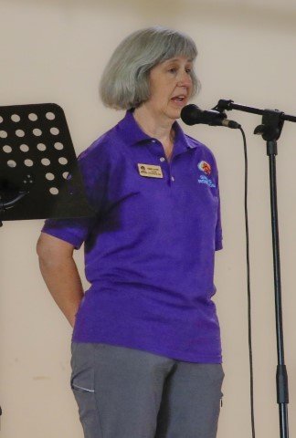
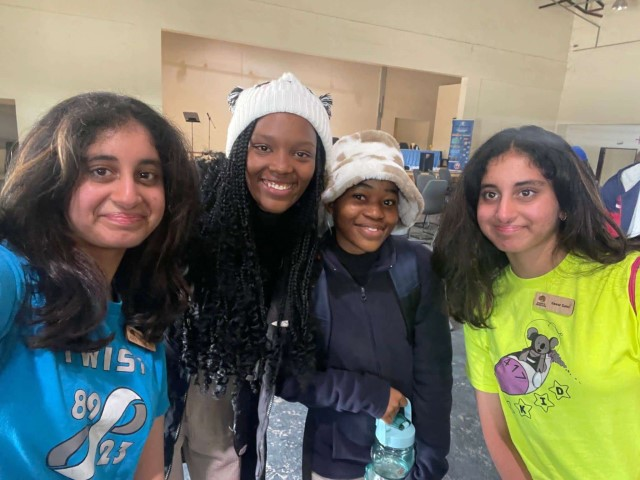
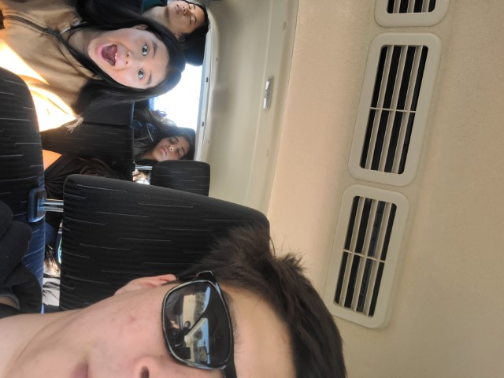

# Botswana Blog

## Days 14-17

### Day 14
Today’s first day of camp was much smoother than the first day of our Maun camp mainly because the innovation hub has more modern accommodations. It was nice to arrive finding the FLL fields already assembled and arranged. We also had a little moment of relief as we discovered we could use the four spike prime core kits we brought with us (instead of the Mindstorms kits Dare to Dream got from Toys R’ Us). As teachers began to arrive, we realized we would have a much fuller house on our first day than last time. We counted 10 people total on our first day and broke them into teams of two and three. We started off with our normal presentation schedule. We were not prepared for the teachers to get into the technical bits so quickly as we hadn’t even taught the coding portion when teams were already trying to complete missions. This was a grand contrast to our experience in Maun, but we adapted and taught a more accelerated course by increasing complexity of the topics covered. By the end of today, most teams had already completed simple push missions. Towards the end of the day, Michael, the director of the Duba Plains safari company, paid us a visit with his children to learn about our work and connect with Dare to Dream! We taught his kids how to program a robot and it was a great opportunity to connect with local kids to teach them robotics (Brianna taught Michael’s daughter how to create designs with the robot’s lights and dance in a circle!).

### Day 15
Today is the second day of camp. Heidi started us off with coaching 101 and Kaitlin followed introducing the innovation project. They were excited to get started with the innovation project as many had a multitude of unique ideas. From cow dung energy plants to solar powered EV charging stations, they all dove straight in with great gusto. Afterwards, we had a core values activity then went on to Guinness’s mechanisms presentation. They began to build with great interest after learning core design principles and then continued to complete more of the complex missions. They had the rest of the day to work on their robots and most teams had completed three missions by the end of today. As the end of the day neared, representatives from Botswana’s Ministry of Education and a man in an orange sweater from the media group in Botswana, came to see the program in action and get more information to advocate for FIRST in Botswana. Tomorrow, we are expecting media coverage and another visit from the ministers.

### Day 16
Today marks the third and final day of our training camp in Gaborone. We were greeted by Captain Phatsima and we were given a tour of the innovation hub which turns out to be just one very large well-crafted donut with multiple layers (it actually looks more like three curved maple bars but it felt like a donut. Lots of long hallways is all). Some points of notability during the tour were the gardens outside, the number of different companies and workspaces that resided within, and the large spiral staircase. It all mostly seemed to be under construction, but it was still pretty cool to walk about and see everything. After that, we returned to the training room where we began to set up. Media representatives soon arrived with large camera equipment and microphones. We were then interviewed about what FIRST is, what we’re doing for the camp, and the purpose of it all. They were intrigued at the sight of all the LEGO robots and the fields, so we offered to teach them some coding and took them through some basic robot control exercises. This only fueled their interest and as a product we may just have gotten two more advocates for the FIRST program in Botswana. We kicked off today with a presentation on FLL competitions and judging, then let them move on to work time to prepare for the competition. After lunch, we started competition with a core values activity where participants tried to instruct their teammates blindly to build a LEGO model. Then, we proceeded to the innovation project presentations. In comparison to the Maun camp these presentations were more detailed (likely due to more time available) and teams this time had materials to create posters to describe their project. Once presentations wrapped up, we started our robot game competition. This was a true demonstration of how quickly these teachers learned. Many had three missions reliably and one even had five (cough cough team fly). In the end, everyone’s performances were very impressive with the top score reaching 175 points. Wild! It was great having everyone there participating, we even drew in the camera man from the media group and the two representatives from the ministry of education. We wrapped everything up with a nice closing ceremony with a few final remarks from Dare to Dream, coaches in training, and us (very emotional!!). Another thing to note, we all were given Setswana names by the camera man, Active. There as follows:

- Kabo (to gift): Ollie
- Naledi (star): Sanj
- One (him/god): Brianna
- Neo (to gift): Sawar
- Tiro (work/job): Guinness
- Mpho (to gift): Kaitlin
 
This marks the end of our journey as we return to America tomorrow by means of too many long plane rides. It’s been an incredible journey that we all will never forget. We are all exhausted, but we would do this for the country of Botswana again in a heartbeat. Seeing how empowered everyone felt after being given this opportunity to explore STEM was inspiring and we look eagerly on to see what Botswana does next. As this story closes another will begin. It couldn’t have been done without the support of our donors, families, mentors, and you! So, from the bottom of our travel weary hearts, thank you.

Botswana Lads signing off.

## Days 12-13
This weekend we had some down time to relax. On Saturday we ate lunch at Botswana Craft and went shopping for some souvenirs. The restaurant there offered Setswana style food and then proceeded to serve some of the most tender lamb, goat, and shredded beef. Also, the chicken nuggets tasted like the ones from Costco and Brianna felt like she was back in Washington (yippee). Then Sanj and Sawar had veggie burgers for the third time this trip. Afterwards, we got to meet Heidi’s cousins in Ramotswa (about 30 mins from Gaborone). It was so lovely to finally get to meet them after hearing Heidi’s story about how she wanted to bring robotics to Botswana because she had family here. When that was finished, we all went for dinner at this grand chicken place called Nando’s. They had some of the most delightful dishes and it was quite fun. The next day, we went to Botswana’s International Museum to learn more about local culture. The museum was unfortunately closed for renovation, but we walked through and perused the art gallery! We saw some of the most unique and well-made art pieces, and a lot of them were going for ridiculously low prices, which made it all more tempting to pool our money and buy all of them to hang up at the shop. Afterwards, we went to an Indian restaurant called Chutney and we were unsure of what the serving portions were, but Sawar and Sanj did a great job leading us to a tasty victory. That evening, we went (very safely, I might add) to visit the Innovation Hub and built all the mission models to prepare for the training camp the next day. We made scrambled eggs and sandwiches for dinner :)

## Day 11
Today we visited the Mahupu Unified Secondary school for a cultural and knowledge exchange. We started off on rough footing as many of us had only found out the day prior that we would be presenting. Furthermore, we were late. An hour late. When we finally arrived, we entered a large auditorium with a stage at the front, over 50 chairs in the audience rows, and two FLL tables near the back, out of the way. There were so many school kids here and they were already messing around with their robots on the fields. Everyone was called over to the audience chairs and then we started the opening ceremonies with Rethabile from Dare to Dream. She first introduced guests such as two tribe chiefs representing their support of the program and other heads sitting at the table (Rob, Heidi, and Phatsima included). We then moved onto the many presentations. Local staff and community leaders spoke on how FLL impacted their communities for the better. FLL team coaches invited students from their teams to share about how FLL impacted them personally. It was truly inspiring to hear how they grew through the program. For our presentations, Heidi had her first keynote speech today! We presented on what FLL means to us, game strategy, robot design principles, core values, the innovation project, and coding practices. In between presentations from leaders of the local community, we had various forms of breaks through a stand-up poem in a native language and traditional dance as part of the cultural exchange.

After all the formalities had finished, we broke for lunch and to students demonstrating their robots. We then got the opportunity to have more intimate conversations with them about who they were, what they were interested in, and how we can help them better understand more complex FLL concepts. We spent a lot of time talking to them about how to use sensors, as their robots, while quite good (as evidenced by the 9 trophies they had on display), could be improved with the usage of color sensors and the gyro sensor. We also showed them the importance of using jigs to line their robots up as we noticed they were just counting squares. We’re just imagining the number of trophies they could be bringing back when they start implementing the advice we gave them. Before we said a solemn goodbye, we made sure to share contact information so we can remain involved in their journey through FLL and life. We all agreed being able to teach and talk with those kids was probably the most fun we’ve had in this entire trip.

Afterwards, we went to this place called RoccoMomma where they served American style food with American style portions. It was probably the most we had eaten in one meal for a while (and not in a good way)!

### Images

## Day 10
Today we traveled for 13 hours from Maun to Gaborone. There really wasn’t much more to this day but it was long and boring. The coolest parts were seeing the sunsets, stars, and eating a lot of food but never having a real meal. We hope you enjoy the photos below.

### Images

## Days 6-9 (Maun training camp)

### Day 1
Today marks the completion of our FIRST LEGO League camp in Maun at the Sedie Junior Secondary School. Our goal with the camp, and really the whole project, is to give teachers the knowledge and tools to coach FLL teams, through a condensed competition season (three days 😱🙀). We taught them the basics such as how the LEGO part system works, how to code, create a research project (the innovation project), how to embrace core values, and utilize design principles.
When we arrived on the first day of camp, we were a bit befuddled as none of the FLL mission models had been built yet.­ With little time on the clock, no wi-fi access, and the coding software missing from the laptops provided, we got to work. This also gave us the opportunity to pull our three students into the process of field set up because we realized they too will have to go through these steps eventually. With the help from the students, we got everything set up with time to get into presentations. They were excited to get started working with robots as we returned to our regularly scheduled programming (pun intended!). As they learned to build and code their robots, we could see their interest start to grow. We finished today with high hopes for the next day!
#### Images

### Day 2
On the second day, we arrived to four times the number of students we initially had. As it turned out, Monday (our first day of training) was president’s day, and so, many had taken the day off. With them having missed a third of the camp, we quickly put them into teams, provided pre-built robots, and caught them up as we moved on to the research project, engineering process, and mechanisms presentations. In their teams, they brainstormed research project ideas and solutions, following the engineering design process. After that, we gave a quick rundown on game strategy again to refresh and introduce the topic to others. From that, they could pick missions they wanted to complete and begin building attachments and programming their robots. We spent the latter part of the day working with them one on one to help strengthen their understanding through hands-on experiences (we had to pry them away from the robots during breaks!). Among other things, we taught teams to use rack and pinion mechanisms and how to make simple line following programs, making sure they understood foundational principles beforehand. Each team faced entirely unique problems and all of us were working hard helping them solve these throughout the day. The room was filled with cheers and high fives every time a team completed a mission. This was the most impactful part of the camp for both us and them. Looking forward to the competition tomorrow!
#### Images

### Day 3
Today was our last day of camp. We covered some logistical topics such as judging and team management then had the robot game and innovation project presentations. With little time to prepare, Heidi presented about coaching 101, giving the teachers a rundown on team management and finances. After presentations were finished, we let teams begin working on their robots to finish any last minute changes before the competition. Young students also came to join us today, providing an interesting challenge of teams nearly doubling in size, educating the students, and bringing them into the teams. It was impressive how quickly they learned the coding and design concepts required for FLL. It was comforting to see how well the teachers that we taught were able to guide the younger students through all the content we had covered in the past two days. Because of this, we can rest easy knowing they will make excellent FLL coaches and leaders of STEM. After lunch, we had our competition where teams each presented to everyone their research project. The teachers had engaged the secondary school students to the point where some even ran the robot during the robot game and presented their team’s project. As the day progressed to the robot game, all teams were loudly cheering for each other and embracing the FIRST core values. Truly enlightening! From this experience we are excited to improve upon our curriculum and bring it to Gaborone.
#### Images

___
## Days 3-6 (safari)
Greetings from the Okavango Delta! We are currently on our last day of safari and have been seeing incredible wildlife during game drives, cooking with the skilled gourmet chefs in the kitchen, and learning about Botswana’s culture. We have been blown away by the amazing hospitality that we have been received with at the safari, from the head chef Siya expertly meeting all our dietary needs, to our guide Piet sharing stories from his culture and teaching us about the animals on game drives. In our down time, we have been rehearsing our presentations for our three-day FLL camp which we will host in Maun in a couple days. On our last day, to help practice and share, we had the opportunity to work with the staff members at the camp and teach them a little about FLL while we waited for our plane to arrive. We are so grateful to be able to experience such an abundant and beautiful ecosystem, and learn from extremely skilled staff. Below are some photos and stories we heard and encountered during our stay.

### Stories*:
We asked one of the guides, Tizzar, how he became so knowledgeable about the land and wildlife, and he explained that from the age of six, he tended to his family's free-range goats, and would need to follow each member of the herd all throughout the day. On a hot day, he and his cousin were out with the goats. They fell asleep when the goats stopped to rest and woke up to find they were gone! Losing his family's goats would have been disastrous, and this was the first time he and his cousin had to track animals, with no one having taught him about the land or how to navigate it. He eventually tracked them all the way home, no goat casualties! Tizzar told us that he learned about the wildlife through all his experiences growing up in rural Botswana, but that kids today are more disconnected from nature due to technology. Hearing about this helped put into perspective how dependent on technology and sheltered our childhoods have been. This in comparison to someone who is so in tune with the intricacies of the natural world where they can distinguish between 50 different goat kids and match them to each of their mothers (that's Tizzar!). (Kaitlin wrote this!)

Piet, our safari guide, shared a cultural concept in Botswana about the relationship between twins. They say that the younger twin pushes the older twin out of the womb to meet the sun. It is then believed that the younger twin is the protector of the older one. This explains the shield that each twin has for each other and how they both always have each other’s backs. We, Sawar and Sanj, relate to this as twins, and how we have love for each other for eternity. (Guess who wrote this!)

Our guide, Piet, showed us one of the only baobab trees in the area (there are only two!). He explained how it is the biggest tree in Africa and how it can grow to an incredible 60 square meters at the base. He told us about how the tree can grow for hundreds of years, and how the inside layers will eventually dry out and create a hollow space inside the tree. There was even a tree so large it was used as a prison a long time ago. (Ollie wrote this!)

When we spotted a herd of zebras, our guide Piet told us that the national animal of Botswana is the zebra. He explained how a politician from Botswana traveled to Britain to study abroad. In the royal court he got to know the princess and they got married. At the time, interracial marriage was considered unacceptable. However they later made Botswana an independent country in 1966 and chose the zebra as the national animal since their black and white stripes represent the end of apartheid in southern Africa and people living in peace regardless of their race. (Brianna wrote this!)

 **(please note that some of these may be inaccurate due to poor short term memory)*

### Animal encounters:
There was a buffalo kill by a coalition of four lions (three male, one female).

    
The other lion. Content warning: The image is fairly graphic.

    

We had elephants in the camp! (not these ones though, it was at night and we didn’t take photos 😢)

We were blessed with two honey badger encounters. This picture is of one that we watched hunt successfully and eat!

Secretary bird (Ollie just really likes this bird). It was very skittish and apparently people come from all over to see this bird. Not particularly rare, but a really cool sight as it gives velociraptor vibes.

Lilac-breasted roller!

Encountered hyenas when they were trying to get at the food the lions above had captured

Hippos are quite scary up close but when at a distance can be a sight to see

#### Honorary mentions:

- Porcupine: got to see it for a few seconds in the daylight (they are nocturnal) before it ran away. Our guide hadn’t seen one for over 4 months, so this was a big deal.

- Wild dogs: these guys were really far away so we didn’t get any good photos but they are really great runners and have a distinct c sharp call to regroup their pack
___
## Days 1-3 (6/26 – 6/28) (it really feels like one long day though)
Dumela! We have experienced four different countries, four international airports, three different plane manufacturers, and many accents in 48 hours (pretty much, we’re rounding!). Despite these exciting adventures, here are our top three things we’re excited to have a break from: cramped spaces, airplane food, and sleeping sitting up (or just getting no sleep). Things we’re excited about are: eating more cultural food (Sawar), meeting new people (Sanj), cultural exchange (Kaitlin), seeing cool animals (Brianna), seeing the sunrise (Ollie), sharing STEM (Guinness). When we finally landed in Maun, we were kindly picked up by a member of the Tshilli Farm who drove us 45 minutes (after patiently waiting for us to figure out luggage out) to the farm where we’re staying. During the drive, so many kids who were walking home from their school day waved and shouted to greet us. Everyone has been incredibly welcoming and hospitable, and we’ve only gotten a taste of Botswana. We will be updating this blog as frequently as we can and you’ll next be hearing about our safari adventures!

.jpeg>)
.jpg>)
.jpg>)
.jpg>)

