# Botswana Blog - 2025

## Day -2 (7/10)

3 days 'til we go to the airport!

We're (mostly) packed and ready for the trip. Reviewing last-minute travel requirements, as well as going over the SPIKE Prime robot code one last time, we had our very last Botswana outreach meeting today.

## Days 1, 2, and 3 (7/13 - 7/15)

We all arrived at the airport with enough time to check bags, get through security without issue, and grabbed some overpriced airport food. When we finally sat down on the plane we had to settle in for a long (15-hour) flight.

The first flight lasted over 15 hours, and we were very tired by the time we got to Doha, 24 hours later. We were lucky enough to have a long enough layover before our next flight to get hotel rooms for a quick rest. We stayed for about 6 hours at the Garden Hotel inside the Doha airport — getting some much-needed, if short, sleep — and got up at midnight to catch our next flight to Johannesburg.

We are currently writing this from the Johannesburg OR Tambo International Airport in South Africa, after an 8-hour flight from Doha. Hanging out in the terminal with us are pigeons. We aren't sure how they got here, but we appreciate the company.

### Edit from Day 4 (7/16):

We had approximately one hour left of flying before we get to the Sir Seretse Khama International Airport, named after the first president of Botswana.

Exhausted but excited, we stayed up until 9:00 PM in order to combat jet lag and get ourselves set up better for the next two weeks.

## Day 4 (7/16)

Everyone woke up at different times today, so we had a nice, chill morning, and we all had fun on our breakfast adventures. Eric and Rob woke up early for a morning run, while Emlyn and Bharvi woke up around 9:00. Everyone starting trickling into the breakfast area where we debated what constituted a sandwich versus a toast, Bharvi made her morning chai, and Eric attempted to flip an egg without a spatula... (spoiler alert - it didn't go well!) 

After breakfast and showers, we were informed that we needed to build a FLL field for the cultural exhange we have tomorrow. The rest of our morning went by with Eric doing some coding, the rest of us building various LEGO model missions, and Heidi writing a bio for her speech tomorrow. It started out theraputic, but we ended up with only 3 missons complete before it was time for lunch.  

For lunch we enjoyed a nice meal at a restaurant in the local mall before heading to a small grocery store to pick up some food for lunch tomorrow. We saw an automatic bread slicer!

We then went back to the AirBNB to do even more LEGO building and SPIKE Prime robot coding before heading out to a nice dinner with Heidi's cousin — the top lawyer in Botswana! — and his wife (this was also at the mall).

Just for funsies, Bharvi and Emlyn tried some mocktails, and so did Heidi, but of course Emlyn didn't know this when Heidi first offered her to try her drink, and she was rather concerned. One of us actually had a fun drink at lunch called "Malawi Shandy" which was a combination of lemonade and "Stoney", a popular and very strong ginger beer in Botswana, and it was throughly enjoyed.

All tired, we drove home to bed, but not before finishing the last of the LEGO work.

## Day 5 (7/17)

The morning started off slow again today with people trickling in as they woke up. Eric and Rob went for a morning run, while Heidi walked, and Sara, Emlyn, Hank, and Bharvi held down the fort at the AirBNB. Since we had to leave at noon, the morning was spent grazing as there wasn't much time to get lunch and we had plenty of food from the store. The morning was also spent — somewhat frantically — coding the robot for the cultural exchange later.

We left just after noon for the cultural exchange event, stopping at the Dare to Dream office first to go over plans. We then drove to the Mogoditshane Senior Secondary School, a upper-ages high-school equivalent, but we also had younger students visiting from the other Mogoditshane Junior Secondary School campus. Of these schools' 1,800 students, we met with around 55 of them in their auditorium. The cultural exchange event began with some speeches, from the schools' leadership, from Dare to Dream founder Captain Kgomotso Phatsima, and even from our very own Heidi. Afterwards, we were treated to a traditional dance. We learned later that this was the group's first time performing the dance, but you would never have been able to tell that it was because they seemed so confident and well-rehearsed. Afterwards, we began to talk with the students. While at first everyone was nervous, since we and the students of Mogoditshane Senior and Junior Secondary School were quiet with nerves, eventually we all got more comfortable and the conversation began to flow.

First, we ran through the basics of FLL robotics: the game, the innovation project, and core values. We made sure to emphasize that in FIRST, robotics is more than just technical skills: it is about leadership, communication, and so much more. The students seemed interested in the program, asking loads of questions about what coding language we used and how the game worked.

After going over FLL, we wanted to learn more about each other's cultures. At first we had group question time, where they asked us questions about America, the school system, the culture, and the weather. The students seemed amazed when we revealed that we were only 15-18 years old and not in our 20s like they expected or thought we were. On the other hand, we asked about their school system, their traditions, and much more. We bonded over our shared experieces of the joys of math in school and were baffled by each other's weather (although Fahrenheit-Celsius conversions had to be made).

We then split up to talk to smaller groups, opening up for questions people were too shy to ask in person. Many photos were taken and many questions were asked. Some students stayed an extra 30+ minutes just to ask more questions. Eric was able to go over his code in more depth, even demonstrating Python and more complex coding aspects, while Emlyn fielded more questions about life in America, universities, and leadership. Hank and Bharvi worked together, further explaining the FLL program and spreading the joy of robotics.

Exhausted, we loaded back into the van and went to dinner. While traveling, we saw cows!

Bharvi was desperate for food other than just hamburgers and fries (honestly, we all were), and so we found a restaurant with a wide variety of food including curry, paneer, ribs, kebab, and so much more, which everyone was able to enjoy. Bharvi enjoyed the food a lot, but not enough to stay awake, accidentally falling asleep at the table. It was possibly a food-induced coma, or maybe it was just from the day's hard work.

## Day 6 (7/18)

We started the day very early because we supposedly had a flight to catch at 8. Eric and Emlyn woke up at 5:45 and everyone else woke up at 6:00-ish. We rushed to get out the door, seeing the sunrise on the way, and were somehow still late, although that ended up not mattering because our flight was delayed till 9:30. However, this meant that we got to enjoy a nice breakfast at the airport, some of us even having carrot cake with our meal. Eric, Heidi, and Emlyn all had breakfast bagels. Eric says his was rather egg-like. 

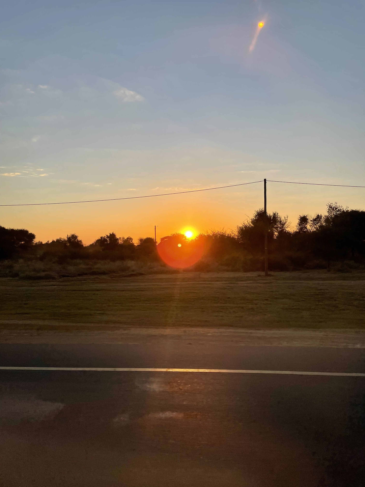

When it was finally close enough to 9:00 we got through security right in time to begin boarding, but not before taking a photo with a wooden elephant sculpture. While in line for boarding, Eric and Hank were informed that their seats were moved and that they had to go to the back because they were "big guys" and the plane needed to be balanced. 

The flight itself was gorgeous. We flew over the stunning landscape of Botswana from south to north. The highlight of the flight was seeing the Makgadikgadi Pan. While we were origanally supposed to see the salt flats in-person and we won't get to do that, flying over them was still a wonderful view.

Once we landed, we grabbed our bags, got a bite to eat, and headed to our hotel to drop our bags and head to the border. Our drive to the Botswana-Zimbabwe border was in an open-sided safari van, so we enjoyed a strong breeze while hoping to spot wildlife. Even though we thought we had pre-applied for visas to get into Zimbabwe, we still had to re-do everything, and even then some of us ran into more trouble with passports. Baboons entertained us with their antics as the rest of us were waiting, and after some troubleshooting, we passed through into Zimbabwe.

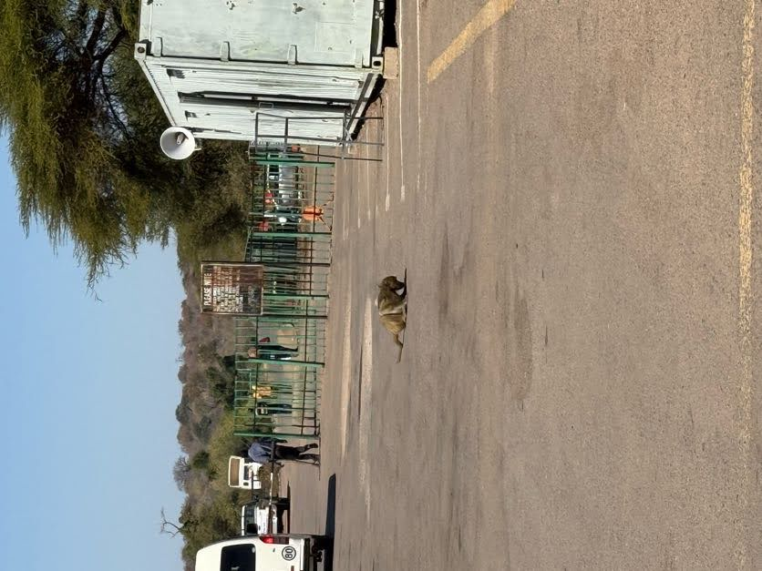

After reaching Zimbabwe, we realized that there was some confusion among the tours that we had booked, and we had to switch drivers. Finally, we reached Victoria Falls. It was absolutely gorgeous and we realized why it was one of the natural wonders of the world. Our favorite site was the first viewpoint, with a rainbow and a part of the falls. We all got drenched halfway through(especially Eric!) and enjoyed the sun as we dried off. 

After we finished the falls, we had to rush to the border in order to we reach there before it was closed. By this point, we were all starving and finally got some food in our systems as well as bought some water. We drove to the hotel and ate dinner together. At the end of the day, we all met up in Bharvi and Emlyn's room to hang out, write this blog, and finish off the day. 

## Day 7 (7/19)

We started our day at 8:00 with a breakfast of plenty of toast, eggs, and cereal. Then we made our way to the safari camp where we were treated to some delicous mango fruit drinks upon arrival, informed about the rest of our stay, and scared away from talking to the lions. After a quick game of cards, we were shown to our rooms and took in the gorgeous view of the Chobe River.

Then we returned to the common area for lunch. Eric, antsy to get moving and forbidden from running around the camp, instigated a trip to the pool. Eric discoverd the pool was far too small, cold, and bug-filled to get any substantial exercise, but we all still sat and enjoyed the sun on our shoulders and the water on our feet. After meeting up for high tea, we headed out on our safari for the first day.

We met our guide and hopped on a open-backed truck before starting to explore the bush. We started by heading towards the river. On the way we met a group of baboons eating some of the thick underbrush.

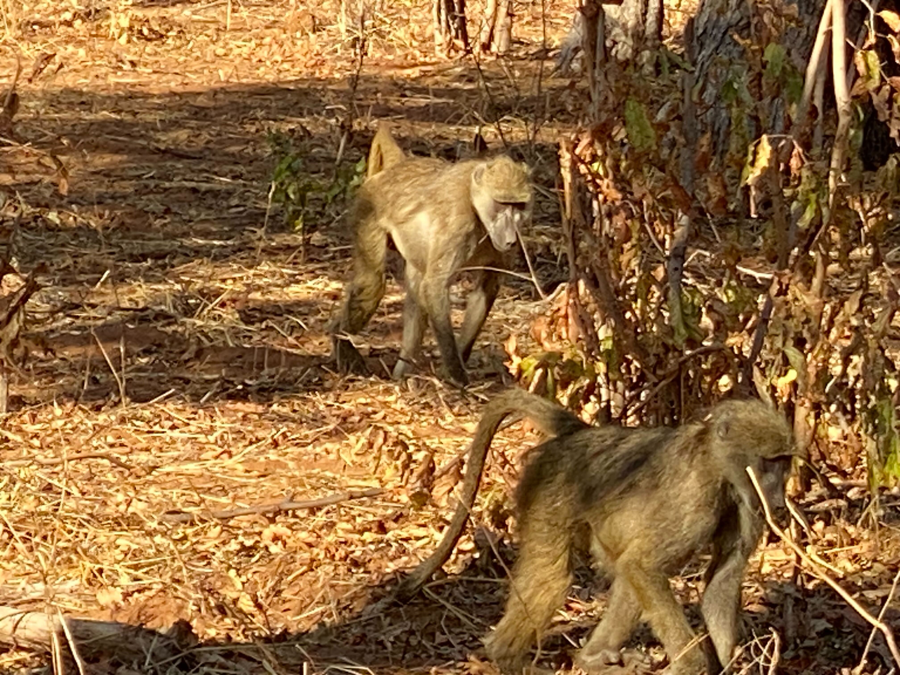

We had expected to have to search for animals, but once we got to the river, they were plentiful. It seemed like we were stopping every few feet to look at a new animal. We spotted giraffes, antelope, impala, zebra and even an elephant. We even saw a real-life zebra crossing! We also saw a crocodile, but only the very top of its head.

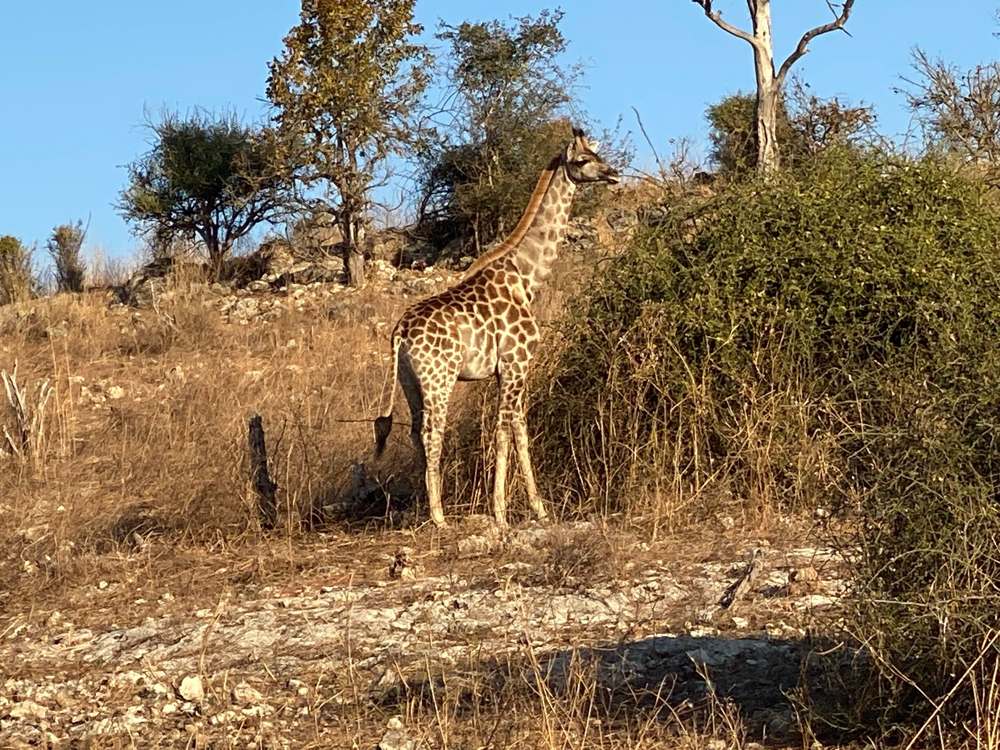

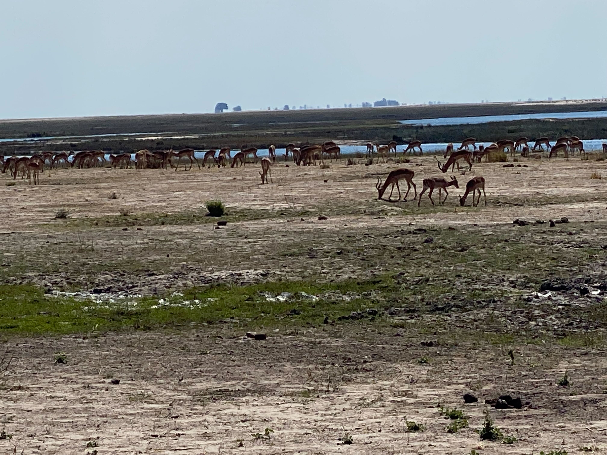

Before it got too late, we headed away from the river in search of the elusory leopard. Unfortunately, we weren't so lucky, but we maintain the hope of seeing it tomorrow morning when we leave at 6:30. Eventually, we stopped for a well-needed snack. Our guide was prepared and brought out drinks for the adults and juices for the kids, as well as naan and hummus as a snack. We watched the sunset while enjoying our small meal.

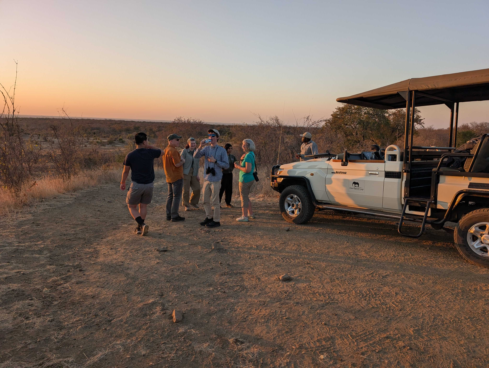

On the way back to the camp, we watched the changing colors of the sky while being struck by incoming bugs.

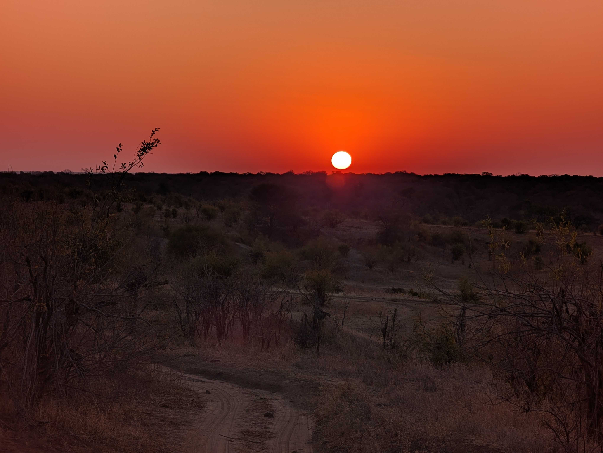

## Day 8 (7/20)

We started out our day before the sun. We weren't allowed to traverse the camp in the dark by ourselves, so our guide came to take us to the common area at 6:00. After finishing our breakfast of cereal, toast, and muffins that were rather like cupcakes, we headed out on our second game drive.

We were able to watch the sun rise as we entered the national park, seeing out first elephant of the day. However, we had our sights set on only one thing: a leopard. Our spectacular guide Isaac took us to where he thought there would most likely be a leopard. On the way we saw giraffes, of which there seemed to be endless numbers.

While the group stopped on the edge of the river for some coffee, tea, and shortbread cookies, we were approached by monkeys who were attempting to steal anything they could. However, our guide chased them away. They were very silly monkeys, jumping around from tree to tree and from safari van to safari van. Nevertheless, we enjoyed our morning treat before heading off on our adventure again.

In between our morning drinks and lunch were the big cats (and also big elephants). First, Isaac took us to where he had heard there had been lions. While they were a little hard to see, we could still see them curled up under a tree. After leaving, we came across a herd of elephants heading towards the river for a drink. We passed them and started to wait for them to arrive. While waiting, Coach Sara turned and was confronted with a leopard slinking between bushes. We followed along, catching glimpses of it when it passed gaps in the foliage, before we finally lost sight of it as it went up a tree. We pulled off the road to get a better view, and watched it survey the terrain, looking for prey.

After a little while longer of viewing the wildlife, we drove to our lunch spot back by the monkeys to enjoy a nice lunch of pasta, salad, bread, and an assortment of crackers and cheeses. We spoke to a lovely family also on the trip that were from the UK. They were telling us about the pygmy goats they had waiting for them upon their arrival home. After packing up our lunch, we headed back out into the bush.

In the period of time after lunch but before the cruise, we saw some of our first hippos of the day. Although they hid quickly by dipping under the water, we were still able to get a fairly good look at them, though this was made more difficult by the fact that we had seven people and one pair of binoculars. We sped along the riverside for another couple hours before heading to the dock where we would launch our river cruise.

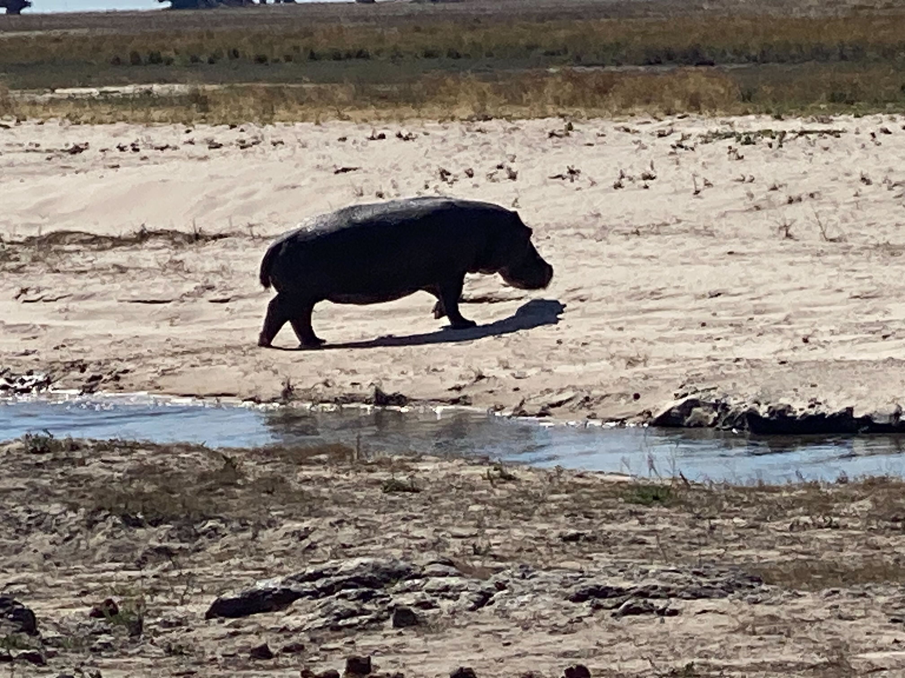

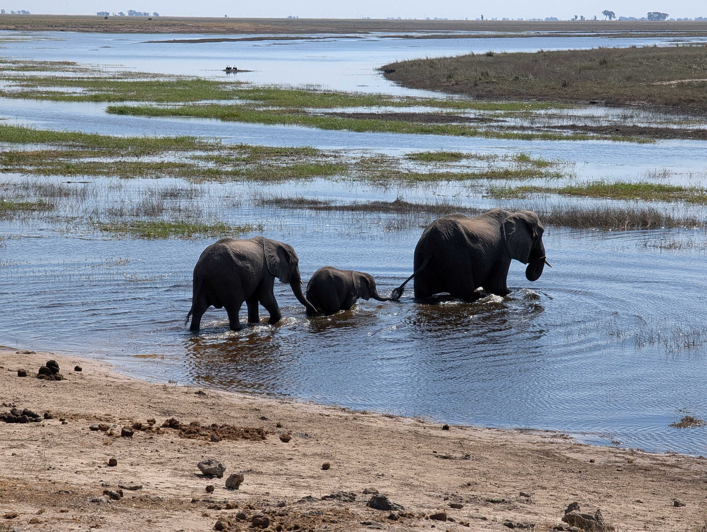

The cruise started with us peering at the many many water-skaters that graced the surface of the water. From there, we enjoyed the flood plains and its many animals. Eric was very excited to see the crocodiles from much closer, as earlier they were only visble from farther away, but by far, the highlight of the river cruise were the birds. They ranged from small, like the king fisher, to huge, like the fish eagle. The fish eagles were the photography gold of the day, with everyone on the boat simply having to snap a photo. After about two hours, we headed back to shore and back into the truck. We rode home rather quickly but made sure to stop for the water buffalo, which we hadn't yet seen on our trip.

When we made it back, we had about an hour of rest time to watch the sun set and to relax a bit after our long day.

## Day 9 (7/21)

Today started just as yesterday did: at 5:30 in the morning. Breakfast was almost the same, except the muffins had raisins this time, and there was oatmeal. We ate quickly and set off on our journey. Our wonderful guide had heard rumors of a cheetah roaming around before the entrance to the park, so we raced over to see it. On the way there, a whole herd of elephants crossed the road in front of us, so we got to stop and watch the parade go by before continuing in search of the cheetah. After a fair amount of driving, we saw in the distance a bunch of the safari vans crowded around the side of the road. As we drove up, we could just barely see the cheetah, but our driver was able to navigate to a better viewing point. The cheetah was walking along the side of the road, marking its scent, and climbing in trees. We were in awe of its agility and coat pattern and watched it for quite a while before actually going into the park.

Today was a cloudy day, so many of the creatures were hiding. This meant that most of what we enjoyed today (at least for the first few hours of the drive) was the landscape. This was more than okay, though, because the clouds gave a completely new look to our surroundings, and also reminded us a bit of home, although no rain fell. We stopped for coffee, tea, and cookies again this morning, and they were more valued today due to the chillier weather.

We took off again in search of the hidden creatures, even going so far as to follow the lions' tracks till they led into the bushes where we couldn't go. Even so, Sara was adamant about seeing lions, and so we continued the search. It was only when Isaac said we had to start heading out of the park that we finally got to see the lions. Through a little off-roading, we managed to get right up near a mother, some teens, and some young ones the guide said were between 3 and 6 months old. Some of the teens were playing around, pawing, and biting each other. Eventually, the mother lion got up and walked away, either to look for food or because she was tired of her kids' shenanigans. The mother lion ended up walking right in front of our vehicle, seemingly unbothered by us. 

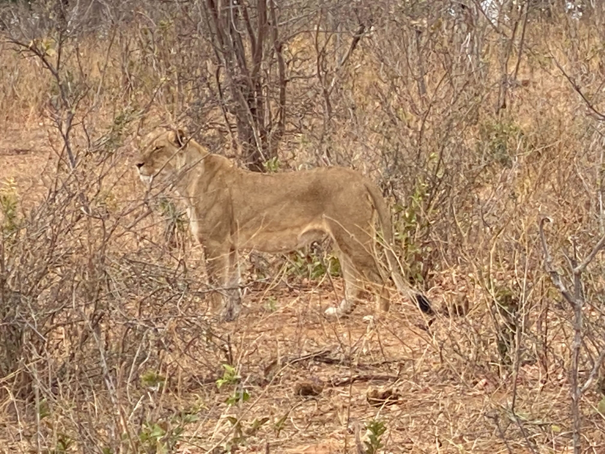

We drove back to the lodge where we got a couple free hours, broken up by a lovely lunch including kebabs, pasta, and salad, which we all enjoyed at our leisure before taking off to either shower, nap, or whatever else we wanted. Then came high tea, with delicious chocolate banana cake and some hair braiding in preparation for our second safari of the day. Shortly after 3:30, we were on the trail again. Our guide took us to the other side of the park, which we hadn’t seen yet. We got to see a dried-up water hole where we learned about animal trails and tracks.

We took various photos of the gorgeous landscape, with an especially wonderful one of antelope, giraffes and elephants all in one frame around the water hole with a sunset in the background. Later, we saw a large group of ants marching out of their mound and some warthogs. We didn't see many new animals, but the landscape was stunning and the safari was almost like a scenic drive. 

After that we stopped for some beverages and snacks with a gorgeous view. We all enjoyed various drinks and continued driving.

On the way back to the camp, we saw a huge herd of elephants crossing our path, and saw a car almost crash into an antelope. After some leisure time and teaching some of the staff about robotics, it was time for dinner. We had butternut soup and white bread rolls. Then, we had eggplant lasagna and roast beef, with roasted potatoes and cucumbers. We had some fun times trying the interesting cauliflower cheese. The chef very kindly made special lactose-free pasta for Eric, who very much enjoyed the meals. Finally, our day ended with Emlyn and Eric retiring for the night and Hank and Bharvi finishing the blog. Overall, it was a fun but tiring day!

## Day 10 (7/22)

In comparison with the last few days, today was rather slow. We slept until 7:00 and started packing to prepare for breakfast at 8:00. After we finished eating, we loaded into a van and headed to the airport to catch our flight back to Gaborone. Due to lack of demand for the direct route, our flight was changed to a quick connection in Maun and then on to Gaborone. We didn't even have to exit the plane! We used the rest of the trip to settle in for some well-deserved sleep.

Once we landed, we reclaimed our bags, rebooked our rental car, and headed out in search of food. For our late lunch, we got burgers at the same place we did the first day, but this time we were more adventurous with our food.

After we finished, we headed to the grocery store to stock up on provisions, then went back to the AirBNB. For the rest of the day, we napped and read, and the girls held a slumber party.

## Day 11 (7/23)

The morning was a confusing period. We had gone to bed the night before without a plan, and, shockingly, when we woke up, there was still no plan. Luckily, the adults worked it all out, but only after multiple plans were made, scrapped, made again, and scrapped again. We finally worked out a plan to go get lunch, do some souvenir shopping, and make our way to our meeting with Dare To Dream at 2:30. 

With a plan now actually in place, we drove to Botswana Craft, a resturant-giftstore location where we enacted both the lunch and souvenir-shopping aspects of our plan. The resturant offered both traditional Setswana and traditional American cuisine. Oxtail, grilled chicken with traditional spices, and some sort of bean meal were tasted and enjoyed by more adventurous members of the group, while others enjoyed pizza and chicken burgers more in their comfort zones. Either way, the food was good. 

An interesting and new experience for us was that just after we had ordered our food, our server came around with a jug of hot soapy water and a big bowl. We put our hands over the bowl while the server poured the water over our hands to clean them. While the experience was new for everyone, it wasn't unpleasant and left us with clean hands ready to eat our meals with. 

After eating, we walked to the store area of Botswana craft. Lots and lots of browsing ensued, and after an hour all of our souvenirs had been purchased. Eric wanted to purchase a decorative ostrich egg but was informed via a conveniently-placed sign by said eggs that the Botswana equivalent of the Department of Fish and Wildlife aren't always thrilled with the eggs being taken out of the country so one might have to make a visit to their office and get a permit. With that knowledge, Eric's hopes of getting a decorative ostrich egg were dashed. Everyone wound up back in the car and we headed to the Dare To Dream office at the Innovation Hub to have a planning meeting for our embassy event on Friday.

Our meeting was incredibly productive. We went in with absolutely no idea what was actually going to be happening at the U.S. Embassy and left with some idea of what was going to be happening at the embassy (along with a lot of homework). With that in mind we made a quick trip to the store to grab supplies for the event and supplies for dinner. So while the students worked on things for the embassy event (and played some Uno), the adults prepared a lovely dinner of spaghetti (with three different sauce options), salad, and garlic bread. Even after dinner, we got back to work planning for the next day and for the embassy (the day after that), though with an early start the next day, things wrapped up pretty quick (except for the laundry, which remained at "1 minute left" for like 5 minutes).

## Day 12 (7/24)

With a hard deadline of being out of the AirBNB at 8:30, people were up and running (some literally) rather early, with people waking up between 6:30 and 7:45. Breakfast was mostly "fend for yourself", but Rob was nice enough to make scrambled eggs for several of us before we had to head out the door.

When we first got to Dare To Dream, we reviewed yesterday's plan before getting to work. Eric and Emlyn worked on writing their "Introduction to FIRST and FLL" speech while Bharvi worked a website and Hank worked on a program to showcase at the event. 

Eventually, students from a local FLL team showed up to work with us. After introductions and explanations, we split into groups with the students to work on preparations for the event. We decided that, for a portion of the event, we would split into stations with one Swerve student and one Botswana student per station. The stations are going to be a robot game demo, a code-it-yourself area, an innovation project station, and a core values station. The hope is to engage the adults with hands-on activities to build excitement for the program. This preparation took up most of the rest of the day with inter-group collaboration and fun. 

At 3:15, we left to have our site visit at the embassy. We went to plan out the location of tables and chairs and other such logistics, before heading back to the AirBNB to work more in preparation for tommorrow.

## Day 13 (7/25)

If we thought yesterday was an early morning, boy were we in for a treat today. Being informed that traffic would be bad, we allotted an hour and a half to get from our AirBNB to the embassy, which meant leaving the house at 6:30, which in turn meant waking up between 5:00 and 5:45 depending on the person, and all of that for there to be very little traffic and for us to arrive a whole hour early. On top of that, our escort through the embassy wasn't there, so we wound up waiting an hour and twenty minutes in the car outside the venue.

Once we finally made it inside, after the initial hectic-ness of getting settled into the venue, we started splitting up and doing various set-up. We finally met up with the younger kids, and Bharvi and Hank worked on assigning and teaching them various tasks while Emlyn and Eric practiced the script and the older kids from Botswana worked on the coding. Later, Bharvi spoke on the podcast _Dumela America_ about her experience in robotics. You can watch that [here](https://www.facebook.com/U.S.EmbassyGaborone/videos/1329566232097610/?app=fbl)!

   

Finally, set-up was completed and guests started trickling in, some arriving in fancy cars with chaffeurs and drivers. Once the opening prayers and welcome remarks were completed, Emlyn, Eric, Lesire, and Kgyle got up and made their prepared speech. They spoke on the FIRST program and its many aspects: both its technical aspects and its core values. They then each covered how being in a FIRST program had impacted them. The audience seemed impressed, especially after Sara informed them that the students had only met, written, and memorized the speech the day before. After that, we started the panel. This was where a series of guests from different fields (including the lovely Heidi Lovett, a financial expert high up in the management of Nando's, the founder of the BRAST program, and a representative from the Ministry of Commerce and Innovation) answered questions from our panel facilitator. The panel ran quite long, and some of us were slightly bored. However, once the most esteemed panelist spoke — a 10-year-old robotics student, president of her team and a wonderful speaker — we perked up and became very excited.

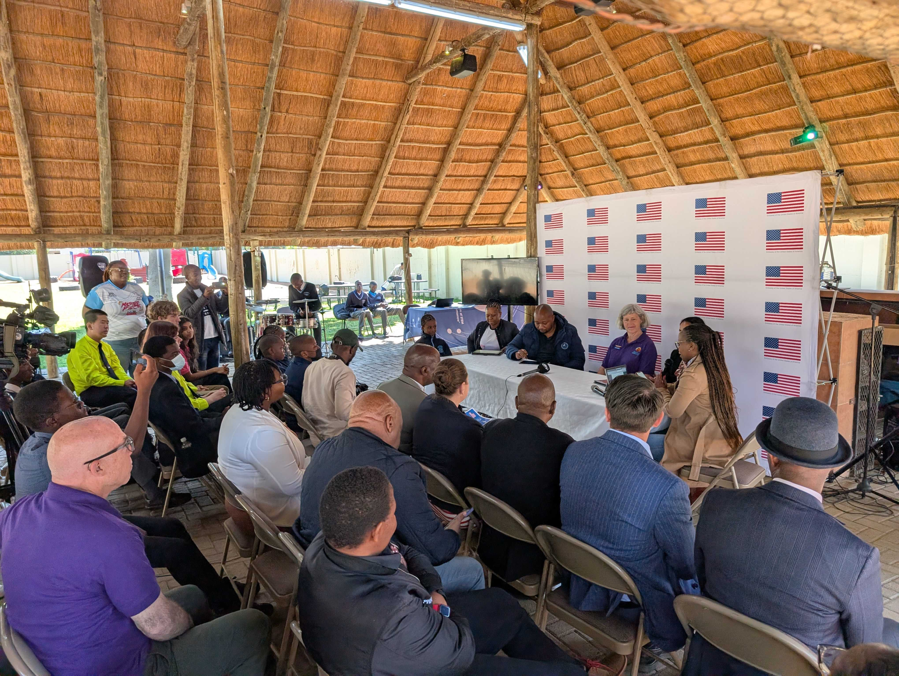

Since the panel ran late, there was a change in schedule so that the dignitaries that had to leave got to see a quick robot demo and left the event excited and inspired (we hope). With time in mind, we began closing remarks, where we heard from the headmaster of the school we met with earlier on the trip. After closing remarks, the audience was free to wander the stations and eat refreshments. The stations garnered a lot of interest, engaging visitors hands-on — especially the coding and robot demo stations. Lots of connections were made and lots of doors were opened. Hank even worked with one of the kids who taught the ambassador from Ukraine to Botsawna how to code! 

After the event wound down, everyone was starving, and so we went to a coffee shop called The Daily Grind to eat and debrief. We had some fun with the "Iced Spiced Chai Lattes" and kombucha we ordered. Eric had kombucha, and others were curious, tried it, and did not like it. Overall, the consensus was that the event went very well and opened many doors — but some things could've gone better, just as any event goes. We discussed some follow-up steps and improvements for the next time and went home. 

When we first got back, we realized the door to one of the showers was jammed, plus the light in the bathroom was incredibly dim. So, lots of phone flashlights and some standing on chairs ensued until Hank walked in, said "let me try", and fixed the problem with no struggle. The rest of the day was simply chilling, with all of us doing different things till the evening, when Emlyn made us all French toast and grilled cheese sandwiches. Emlyn and Bharvi drove Eric insane by sorting and messing up our jar of colored rubberbands. Everyone is talking and writing the blog before we retire for the night. 

## Day 14 (7/26)

Since yesterday’s wake up call arrived so early, today’s was noticeably less jarring. People meandered into the kitchen as their hearts or their stomachs desired. The plumbers came over again to attempt to fix the issue they tried to fix last time, with no luck still. 

Around noon, we set off for historic downtown. We decided to give Nando’s a shot for lunch and the overall consensus was good. Earlier in the day, we had checked the website for Botswana’s National Museum and it claimed to be closed Saturday–Monday. This was saddening for a bit, but then when we drove past the museum on the way to lunch, it appeared to be open? We figured it was worth a shot, so, after lunch, we made the 4 minute walk over to the museum. Lo and behold, the museum was in fact open!

We explored the exhibits for a bit, some of us faster than others, learning about the history of Botswana, their cultural sites, their modern politics, and so much more. Unfortunately, the majority of the museum was seemingly under construction, so there wasn’t a whole lot to see. So, after a little while we moved on.

We decided to explore historic downtown a little bit. Specifically, we explored the stalls and stands that lined the streets. The adults shopped slower, only making one or two trips down the streets; meanwhile, the students lapped them several times, walking back and forth and back and forth.

Eventually, we met up with Heidi’s friend Gaone and her kids. We went to a historic hotel for tea (and milkshakes and cake) as well as insightful conversation. We talked about the FIRST programs, geography, various different school systems, and our event yesterday. Unfortunately, the sun was rapidly setting, and our new friends wanted to get home before dark.

With that, we went to the grocery store for what we hope will be the last time, grabbing food for dinner and breakfast for tomorrow and Monday before we leave. Everyone seemed pretty tuckered out, so we went home and proceeded to sit by ourselves in various corners of the house, all grabbing dinner as we pleased and retiring to bed.

## Day 15 (7/27) 

With one full day left, we decided to spend it experiencing as much of Botswana’s nature and culture as possible. We woke up early in the morning and went on a beautiful hike. It was stunning, but incredibly rocky. There were two groups, one slower and one faster. In the end, both (one with far more breaks) made it up to the top and looked at the gorgeous view of the city and quarry. It was the highest point in Gabarone!

We were all exhausted and went home to shower and eat. We all took turns to shower, and ate quick meals of grilled cheese and peanut butter and jelly sandwiches. Afterwards, everyone got dressed and ready for the dance performance that Kevin, our photographer for the trip, had recommended to us the day before. 

When we arrived, we were over half an hour early, so we took some time to walk around, chat, stand in the sun, and finally wait in line. Because the internet was slow and we don’t know Tswana, we had very little idea of what the actual performance was about and thus went in blind, not knowing what to expect.

The first act was very, very, very difficult to sit through. Not because it was bad (the performances and dancers were absolutely mind-blowing), but because we were expecting a more light-hearted dance performance and got a gritty, visceral performance about the true and horrifying story of Segametsi Mogomotsi and the riots that followed her kidnapping and ritualistic murder. The dance was incredibly powerful and left us all feeling a variety of different emotions.

Once we’d all gotten through the heavy emotional load of the first act, though, we could appreciate the storyline and the dancers from an artistic perspective, as well as the live sound effects and spotlights. The second act was much lighter but still an important part of Botswana's history. It was about boys going to work in South African gold mines, partying and dancing, and returning home to their wives and daughters. Most of us absolutely adored the production, and we found out afterwords that the troupe had been invited for the World Dance Festival in South Korea. We also learned at the Vice President of Botswana was in attendance. He was called up onstage after the performance to shake hands with the dancers and the behind-the-scences workers.

After the performance, we spent some time talking to the dancers and producers, learning more about their program and how to support them. After, we ecided to go to the mall to kill some time, shop, and later have dinner. Unfortunately, we found that the mall was mostly closed because it was Sunday so went for an early dinner instead. We went back to Bukhara, the restaurant we’d been to with Dare to Dream, and had a lovely dinner, with Bharvi getting her Indian food and various shakes and desserts. Finally, we were all exhausted and some of us did some grocery shopping before we went home and wrote the blog, dropped some things off, and killed some time before we all went to sleep in prep for the next day.

## Day 16 (7/28) and Day 17 (7/29)

This morning started as most of the rest did, with people waking up at various times in preparation for our exit interviews with our photographer Kevin. The hope is that by talking about our experience, we can encourage future groups of students, whether in the US or in Botswana to continue with the program as well as to get closure on the experience for ourselves.

Then we left to get some last goodbyes with our partners, Dare to Dream. After a long discussion about the future of the program, we were drawn by our stomachs to the mall where we picked up lunch. The first time we had been at that mall, we noticed a very cool special store, but unfortunately, we didn't get a chance to shop. This grave injustice was rectified immediately! More souvenirs were quickly purchased and we headed to the airport to return our van before 3:00. We had a tea (or juice) party before one last goodbye with Captain Phatsima, the leader of Dare to Dream.

Our first flight to Johannesburg was just a quick hour. After we landed Eric's quest began! After being unable to buy an egg in Gaborone, Eric got his hopes up about being able to purchase one in the airport, once we were safely past customs. SOME of the group didn't think Eric would be able to make it to his egg in time for the 2:00 hour layover. Once we got through the passport check, we ran through arrivals, anxiously waited for the security line, then sprinted to the prize. A giftshop we know had the eggs. In the end, we managed to secure the egg with plenty of time to spare.

Once we reached Doha, we had to say goodbye to Bharvi, as she was flying straight to India to intern as a radio jockey! Unfortunately, no one actually knew where we were dropping Bharvi off. Heidi and Bharvi ran up and down the airport three times before finally handing her over to an airport employee who promised to take her to the drop off location. Heidi was able to make it back to the terminal just before the plane started boarding.

The rest of the trip was relatively uneventful. Once we made it back to Seattle, everyone was ready to reunite with their families, so made some quick goodbyes, before heading for home.

We're grateful to all who made the trip possible.

Thank you, sponsors and donors.
Thank you, Botswana.
Thank you, U.S. Embassy.
Thank you, Dare To Dream.
And, finally, thank you, Swerve Robotics.