# Botswana Blog - 2025

## Day -2 (7/10)

3 days 'til we go to the airport!

We're (mostly) packed and ready for the trip. Reviewing last-minute travel requirements, as well as going over the SPIKE Prime robot code one last time, we had our very last Botswana outreach meeting today.

## Days 1, 2, and 3 (7/13 - 7/15)

We all arrived at the airport with enough time to check bags, get through security without issue, and grabbed some overpriced airport food. When we finally sat down on the plane we had to settle in for a long (15-hour) flight.

The first flight lasted over 15 hours, and we were very tired by the time we got to Doha, 24 hours later. We were lucky enough to have a long enough layover before our next flight to get hotel rooms for a quick rest. We stayed for about 6 hours at the Garden Hotel inside the Doha airport — getting some much-needed, if short, sleep — and got up at midnight to catch our next flight to Johannesburg.

We are currently writing this from the Johannesburg OR Tambo International Airport in South Africa, after an 8-hour flight from Doha. Hanging out in the terminal with us are pigeons. We aren't sure how they got here, but we appreciate the company.

### Edit from Day 4 (7/16):

We had approximately one hour left of flying before we get to the Sir Seretse Khama International Airport, named after the first president of Botswana.

Exhausted but excited, we stayed up until 9:00 PM in order to combat jet lag and get ourselves set up better for the next two weeks.

## Day 4 (7/16)

Everyone woke up at different times today, so we had a nice, chill morning, and we all had fun on our breakfast adventures. Eric and Rob woke up early for a morning run, while Emlyn and Bharvi woke up around 9:00. Everyone starting trickling into the breakfast area where we debated what constituted a sandwich versus a toast, Bharvi made her morning chai, and Eric attempted to flip an egg without a spatula... (spoiler alert - it didn't go well!) 

After breakfast and showers, we were informed that we needed to build a FLL field for the cultural exhange we have tomorrow. The rest of our morning went by with Eric doing some coding, the rest of us building various LEGO model missions, and Heidi writing a bio for her speech tomorrow. It started out theraputic, but we ended up with only 3 missons complete before it was time for lunch.  

For lunch we enjoyed a nice meal at a restaurant in the local mall before heading to a small grocery store to pick up some food for lunch tomorrow. We saw an automatic bread slicer!

We then went back to the AirBNB to do even more LEGO building and SPIKE Prime robot coding before heading out to a nice dinner with Heidi's cousin — the top lawyer in Botswana! — and his wife (this was also at the mall).

Just for funsies, Bharvi and Emlyn tried some mocktails, and so did Heidi, but of course Emlyn didn't know this when Heidi first offered her to try her drink, and she was rather concerned. One of us actually had a fun drink at lunch called "Malawi Shandy" which was a combination of lemonade and "Stoney", a popular and very strong ginger beer in Botswana, and it was throughly enjoyed.

All tired, we drove home to bed, but not before finishing the last of the LEGO work.

## Day 5 (7/17)

The morning started off slow again today with people trickling in as they woke up. Eric and Rob went for a morning run, while Heidi walked, and Sara, Emlyn, Hank, and Bharvi held down the fort at the AirBNB. Since we had to leave at noon, the morning was spent grazing as there wasn't much time to get lunch and we had plenty of food from the store. The morning was also spent — somewhat frantically — coding the robot for the cultural exchange later.

We left just after noon for the cultural exchange event, stopping at the Dare to Dream office first to go over plans. We then drove to the Mogoditshane Senior Secondary School, a upper-ages high-school equivalent, but we also had younger students visiting from the other Mogoditshane Junior Secondary School campus. Of these schools' 1,800 students, we met with around 55 of them in their auditorium. The cultural exchange event began with some speeches, from the schools' leadership, from Dare to Dream founder Captain Kgomotso Phatsima, and even from our very own Heidi. Afterwards, we were treated to a traditional dance. We learned later that this was the group's first time performing the dance, but you would never have been able to tell that it was because they seemed so confident and well-rehearsed. Afterwards, we began to talk with the students. While at first everyone was nervous, since we and the students of Mogoditshane Senior and Junior Secondary School were quiet with nerves, eventually we all got more comfortable and the conversation began to flow.

First, we ran through the basics of FLL robotics: the game, the innovation project, and core values. We made sure to emphasize that in FIRST, robotics is more than just technical skills: it is about leadership, communication, and so much more. The students seemed interested in the program, asking loads of questions about what coding language we used and how the game worked.

After going over FLL, we wanted to learn more about each other's cultures. At first we had group question time, where they asked us questions about America, the school system, the culture, and the weather. The students seemed amazed when we revealed that we were only 15-18 years old and not in our 20s like they expected or thought we were. On the other hand, we asked about their school system, their traditions, and much more. We bonded over our shared experieces of the joys of math in school and were baffled by each other's weather (although Fahrenheit-Celsius conversions had to be made).

We then split up to talk to smaller groups, opening up for questions people were too shy to ask in person. Many photos were taken and many questions were asked. Some students stayed an extra 30+ minutes just to ask more questions. Eric was able to go over his code in more depth, even demonstrating Python and more complex coding aspects, while Emlyn fielded more questions about life in America, universities, and leadership. Hank and Bharvi worked together, further explaining the FLL program and spreading the joy of robotics.

Exhausted, we loaded back into the van and went to dinner. While traveling, we saw cows!

Bharvi was desperate for food other than just hamburgers and fries (honestly, we all were), and so we found a restaurant with a wide variety of food including curry, paneer, ribs, kebab, and so much more, which everyone was able to enjoy. Bharvi enjoyed the food a lot, but not enough to stay awake, accidentally falling asleep at the table. It was possibly a food-induced coma, or maybe it was just from the day's hard work.

## Day 6 (7/18)

We started the day very early because we supposedly had a flight to catch at 8. Eric and Emlyn woke up at 5:45 and everyone else woke up at 6:00-ish. We rushed to get out the door, seeing the sunrise on the way, and were somehow still late, although that ended up not mattering because our flight was delayed till 9:30. However, this meant that we got to enjoy a nice breakfast at the airport, some of us even having carrot cake with our meal. Eric, Heidi, and Emlyn all had breakfast bagels. Eric says his was rather egg-like. 

When it was finally close enough to 9:00 we got through security right in time to begin boarding, but not before taking a photo with a wooden elephant sculpture. While in line for boarding, Eric and Hank were informed that their seats were moved and that they had to go to the back because they were "big guys" and the plane needed to be balanced. 

The flight itself was gorgeous. We flew over the stunning landscape of Botswana from south to north. The highlight of the flight was seeing the Makgadikgadi Pan. While we were origanally supposed to see the salt flats in-person and we won't get to do that, flying over them was still a wonderful view.

Once we landed, we grabbed our bags, got a bite to eat, and headed to our hotel to drop our bags and head to the border. Our drive to the Botswana-Zimbabwe border was in an open-sided safari van, so we enjoyed a strong breeze while hoping to spot wildlife. Even though we thought we had pre-applied for visas to get into Zimbabwe, we still had to re-do everything, and even then some of us ran into more trouble with passports. Baboons entertained us with their antics as the rest of us were waiting, and after some troubleshooting, we passed through into Zimbabwe.

After reaching Zimbabwe, we realized that there was some confusion among the tours that we had booked, and we had to switch drivers. Finally, we reached Victoria Falls. It was absolutely gorgeous and we realized why it was one of the natural wonders of the world. Our favorite site was the first viewpoint, with a rainbow and a part of the falls. We all got drenched halfway through(especially Eric!) and enjoyed the sun as we dried off. 

After we finished the falls, we had to rush to the border in order to we reach there before it was closed. By this point, we were all starving and finally got some food in our systems as well as bought some water. We drove to the hotel and ate dinner together. At the end of the day, we all met up in Bharvi and Emlyn's room to hang out, write this blog, and finish off the day. 

## Day 7 (7/19)

We started our day at 8:00 with a breakfast of plenty of toast, eggs, and cereal. Then we made our way to the safari camp where we were treated to some delicous mango fruit drinks upon arrival, informed about the rest of our stay, and scared away from talking to the lions. After a quick game of cards, we were shown to our rooms and took in the gorgeous view of the Chobe River.

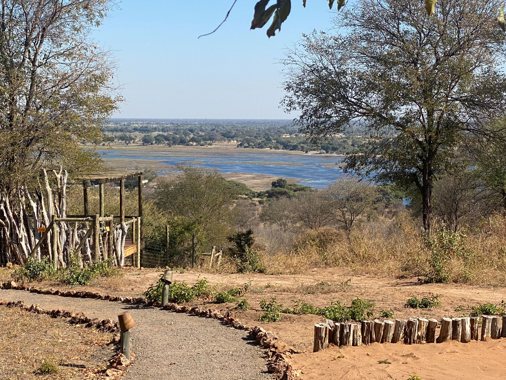

Then we returned to the common area for lunch. Eric, antsy to get moving and forbidden from running around the camp, instigated a trip to the pool. Eric discoverd the pool was far too small, cold, and bug-filled to get any substantial exercise, but we all still sat and enjoyed the sun on our shoulders and the water on our feet. After meeting up for high tea, we headed out on our safari for the first day.

We met our guide and hopped on a open-backed truck before starting to explore the bush. We started by heading towards the river. On the way we met a group of baboons eating some of the thick underbrush.

We had expected to have to search for animals, but once we got to the river, they were plentiful. It seemed like we were stopping every few feet to look at a new animal. We spotted giraffes, antilope, impala, zebra and even an elephant. We even saw a real-life zebra crossing! We also saw a crocodile, but only the very top of its head.

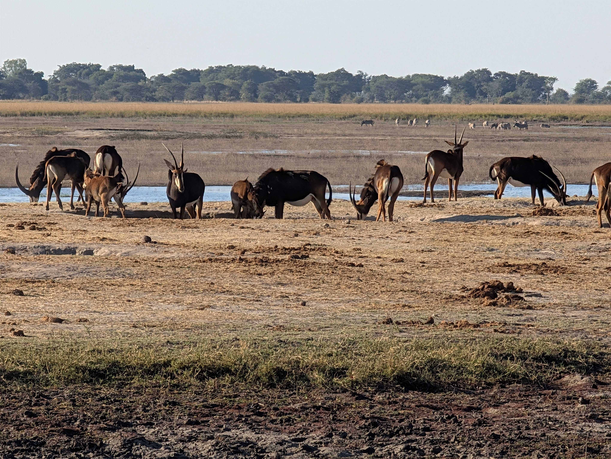

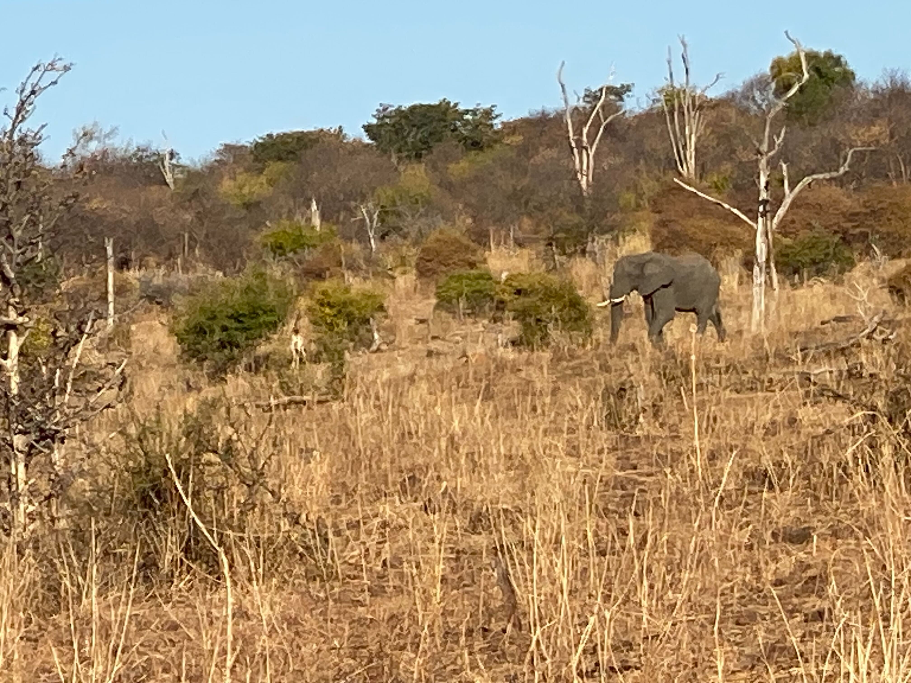

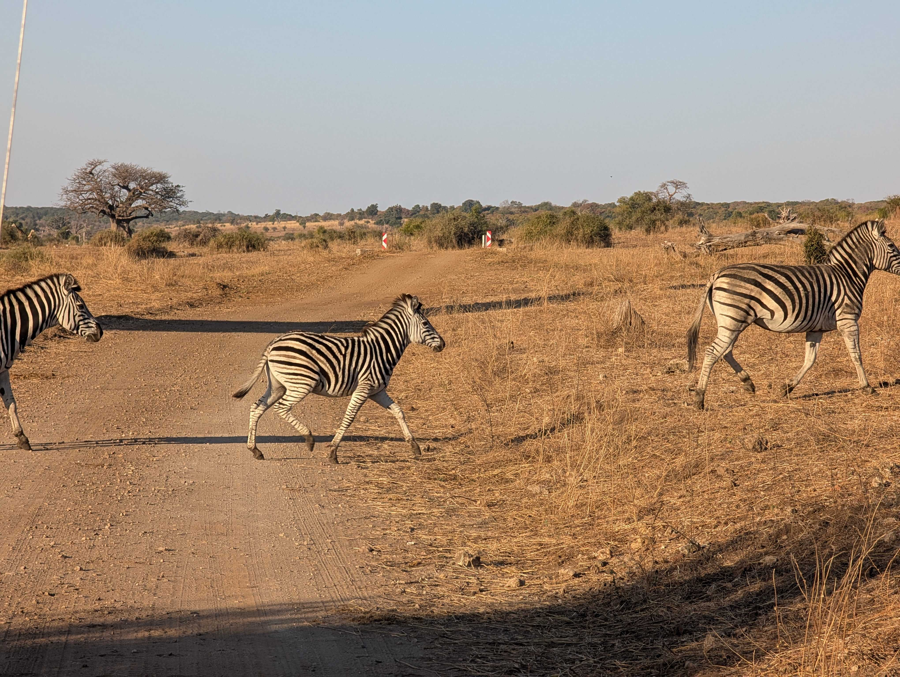

Before it got too late, we headed away from the river in search of the elusory leopard. Unfortunately, we weren't so lucky, but we maintain the hope of seeing it tomorrow morning when we leave at 6:30. Eventually, we stopped for a well-needed snack. Our guide was prepared and brought out drinks for the adults and juices for the kids, as well as naan and hummus as a snack. We watched the sunset while enjoying our small meal.

On the way back to the camp, we watched the changing colors of the sky while being struck by incoming bugs.

## Day 8 (7/20)

We started out our day before the sun. We weren't allowed to traverse the camp in the dark by ourselves, so our guide came to take us to the common area at 6:00. After finishing our breakfast of cereal, toast, and muffins that were rather like cupcakes, we headed out on our 2nd game drive.

We were able to watch the sun rise as we entered the national park, seeing out first elephant of the day, However we had our sights set on only one thing: a leopard. Our spectacular guide Isaac took us to where he thought it most likely be a leopard. On the way we saw all sorts of other wonderful creatures, namely giraffes, of which there seems to be endless numbers.

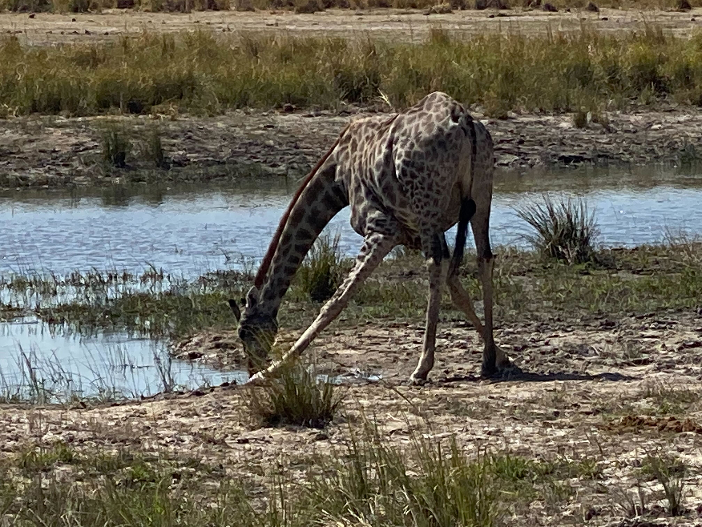

While the group stoped on the edge of the river for some coffee, tea, and shortbread cookies we were approached by monkeys who were attempting to steal anything they could, however our guide chased them away. They were very silly monkeys, jumping around from tree to tree and safari van to safari van. Nevertheless, we enjoyed our morning treat before heading off on our adventure again.

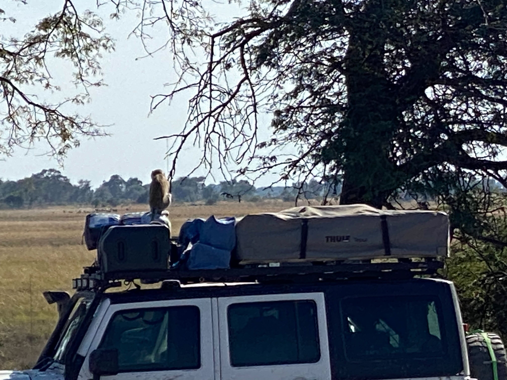

Inbetween our morning drinks and lunch was the time period of big cats (and also big elephants). First, Isaac took us to where he had heard there had been lions. While they were a little hard to see we could still see them curled up under a tree. After leaving, we came across a herd of elephants heading towards the river for a drink. We passed them and started to wait for them to arrive. While waiting, Coach Sara turned and was confrunted with a Leopard slinking between bushes. We followed along, catching glimpses of it when it passed in front of gaps in the foliage, before we finally lost sight of it up a tree. We pulled off the road to get a better view, and watched it survey the terrain, looking for prey.

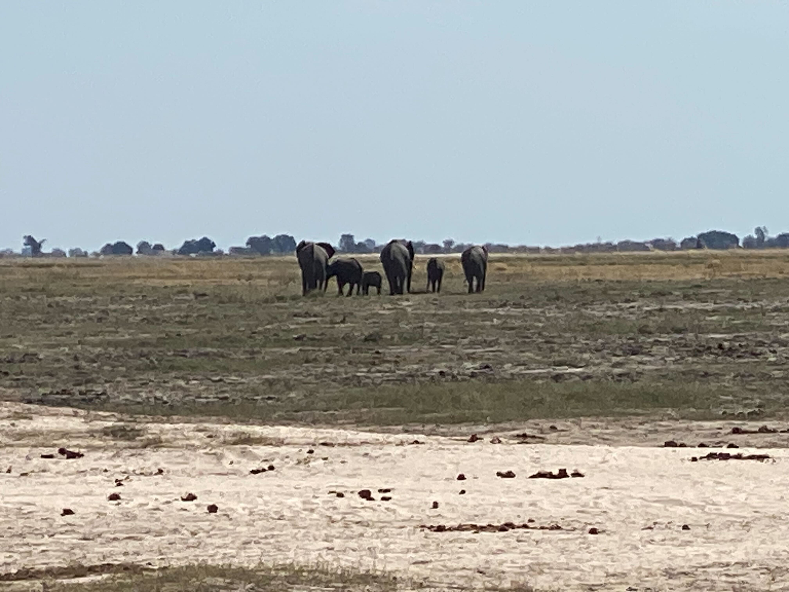

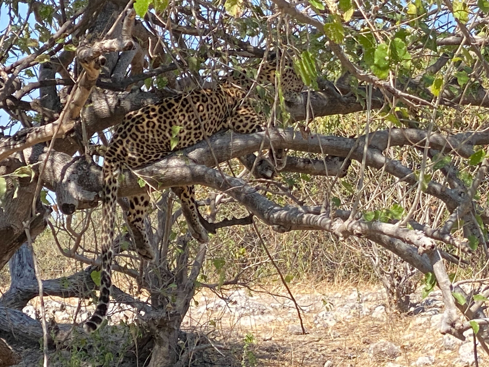

After a little while longer of viewing the wildlife we drove to our lunch spot, back by the monkeys, to enjoy a nice packed away lunch of pasta, salad, bread, and an assortment of crackers and cheeses. We spoke to a lovely family also on the trip that were from the UK. They were telling us about the pygmy goats they had waiting for them upon their arrival home. After packing up our lunch, we headed back out into the bush.

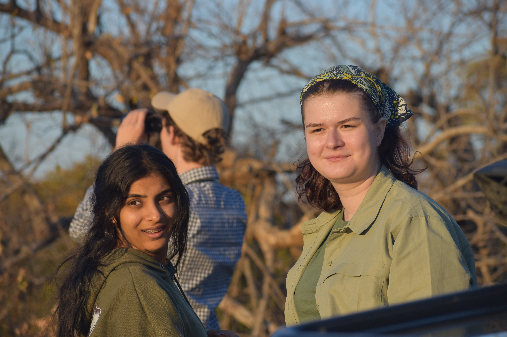

In our after-lunch-before-cruise time period we saw some of our first Hippos of the day. Although they hid quickly by dipping under the water we were still able to get a fairly good look at them, though this was made more difficult by the fact that it was 4 people and one pair of binoculars. We speed along the river side for another couple hours before heading to the dock where we would launch our river cruise.

The cruise started by peering at the many many water-skaters that graced the surface of the water. From there, we enjoyed the flood plains and it's many animals. Eric was very excited to see the crocodiles much closer as early they were only visble from farther away, but by far, the highlight of the river cruise were the birds. They ranged from small, like the king fisher, to huge like the fish eagle. The fish eagles were the photography gold of the day, with everyone on the boat simply having to snap a photo. After about two hours, we headed back to shore and back into the truck. We rode home rather quickly but made sure to stop for the water buffalo, which we hadn't yet seen on our trip.

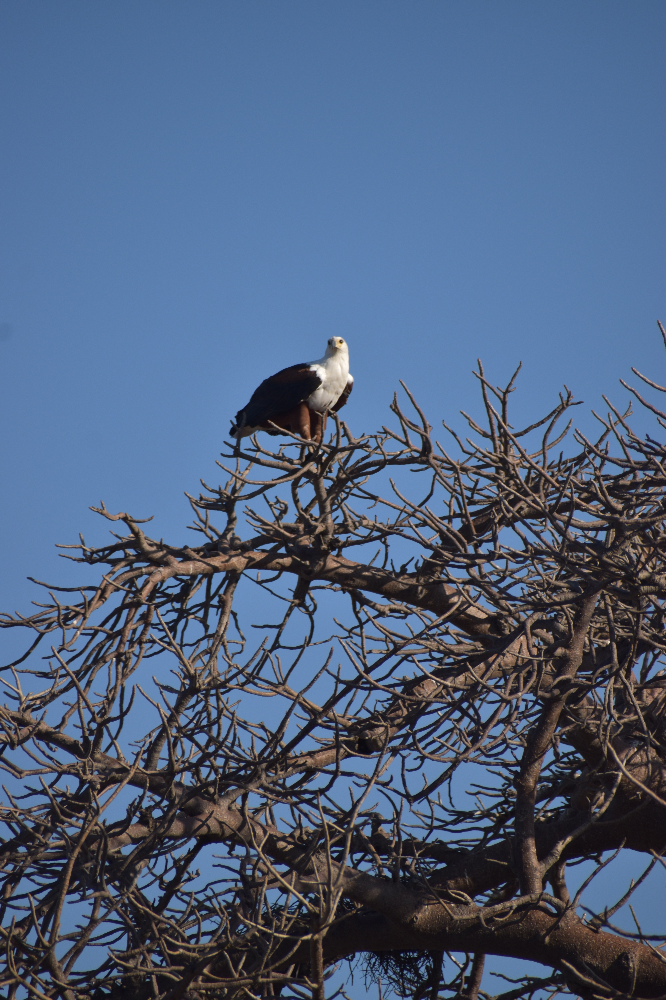

When we made it back we had about an hour of rest time, to watch the sun set and to relax a bit after our long day.

## Day 9 (7/21)

Today started just as yesterday did, at 5:30 in the morning. Breakfast was almost the same except the muffins had raisins this time and there was oatmeal. We ate quickly and set off on our journey. Our wonderful guide had heard rumor of Cheetah roaming around before the entrance to the park so we raced over to see it. On the way there, a whole herd of elephant crossed the road infront of us, so we got to stop and watch the parade go by before continuing in search of the Cheetah. After a fair amount of driving we saw in the distance a bunch of the safari vans crowded around the side of the road. As we drove up, we could just barely see the Cheetah but our driver was able to navigate of a better view. The cheetah was just walking along the side of the road, marking its scent, and climbing in trees. We were in awe over its agility and coat pattern and watched it for quite a while before actually going into the park.

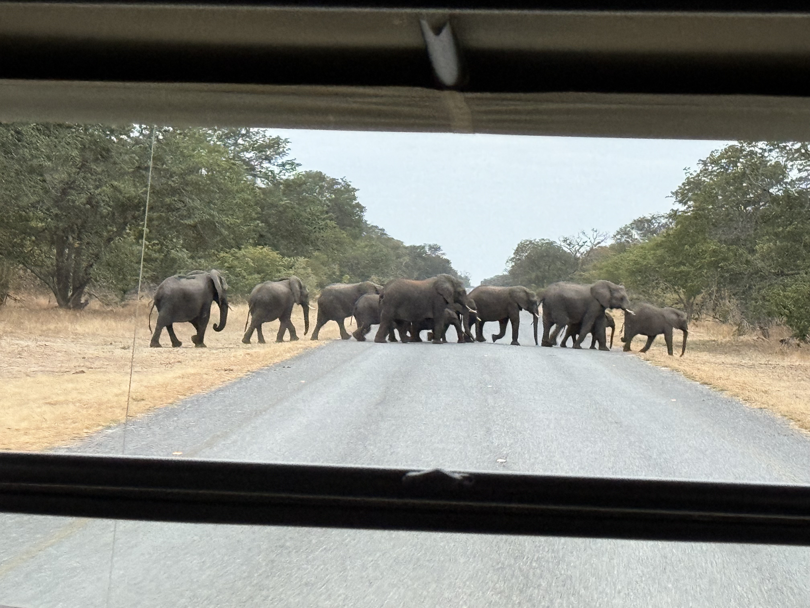

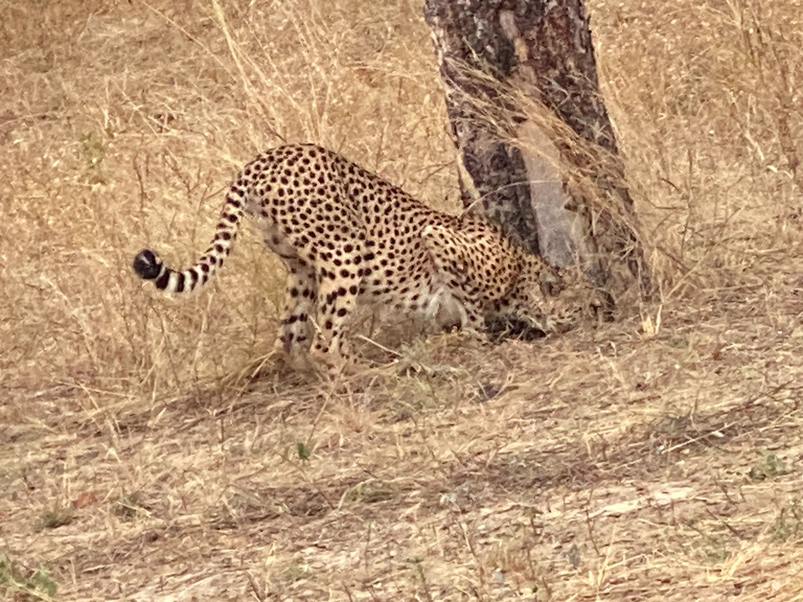

Today was a cloudy day so many of the creatures were hiding. This meant that most of what we enjoyed today, at least for the first few hours of the drive, was the landscape. This was more than okay though, because the clouds gave a completely new look to our surroundings and also reminded us a bit of home although no rain fell. We stoped for coffee, tea, and cookies again this morning and they were more valued today due to the chillier weather.

We took off again in search of the hidden creatures, even going to far and to follow the lions tracks till they led into the bushes where we couldn't go, but Sara was adament about seeing lions and so we continued the search. It was only when Isaac said we had to start heading out of the park that we finally got to see the lions. Through a little off-roading, we managed to be right up near a mother, some teens, and some young ones the guide said were between 3 and 6 months old. Some of the teens were playing around, pawing and biting eachother. Eventually the mother lion got up and walked away, either to look for food, or because she was tired of her kids shennannigans. The mother lion ended up walking right infront of our vehicle, seemingly unbothered by us. 

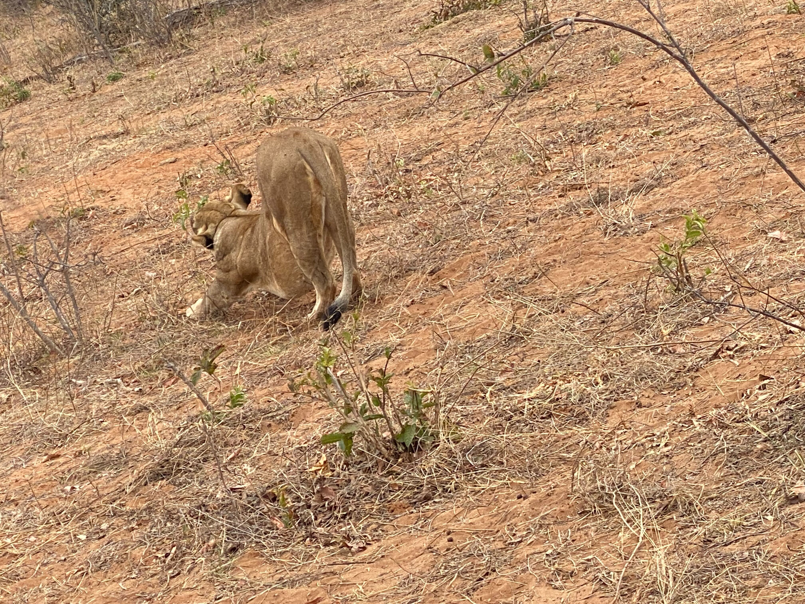

We drove back to the lodge where we got a couple free hours, broken up by a lovely lunch including kebabs, pasta, and salad, which we all enjoyed at our leisure, before taking off to either shower, nap, or whatever else we wanted. Then came high tea, with delicious chocolate banana cake and some hair braiding in preparation for our second safari of the day. Shortly after 3:30, we were on the trail again. Our guide took us to the other side of the park, which we hadn’t seen yet. We got to see a dried up water hole where we learned about animal trails and tracks.

We took various photos of the gorgeous landscape, with an especially wonderful angle of antelope, giraffes and elephants all in one frame around the water hole with a sunset in the background. Later, we saw a large group of ants marching out of their mound and some warthogs. We didn't see many new animals, but the landscape was stunning and the safari was almost like a scenic drive. 
After that we stopped for some beverages and snacks with a gorgeous view. We all enjoyed various drinks and continued driving.

On the way back to the camp, we saw a huge herd of elephants crossing our path, and saw a car almost crash into an antelope. After some leisure time and teaching some of the staff about robots, it was time for dinner. We had butternut soup and white bread rolls. Then, we had eggplant lasagna and roast beef, with roasted potatoes and cucumbers. We had some fun times trying the interesting cauliflower cheese. The chef very kindly made special pasta for Eric, who very much enjoyed the meals. Finally, our day ended with Emlyn and Eric retiring for the night and Hank and Bharvi finishing the blog. Overall, it was a fun but tiring day!

