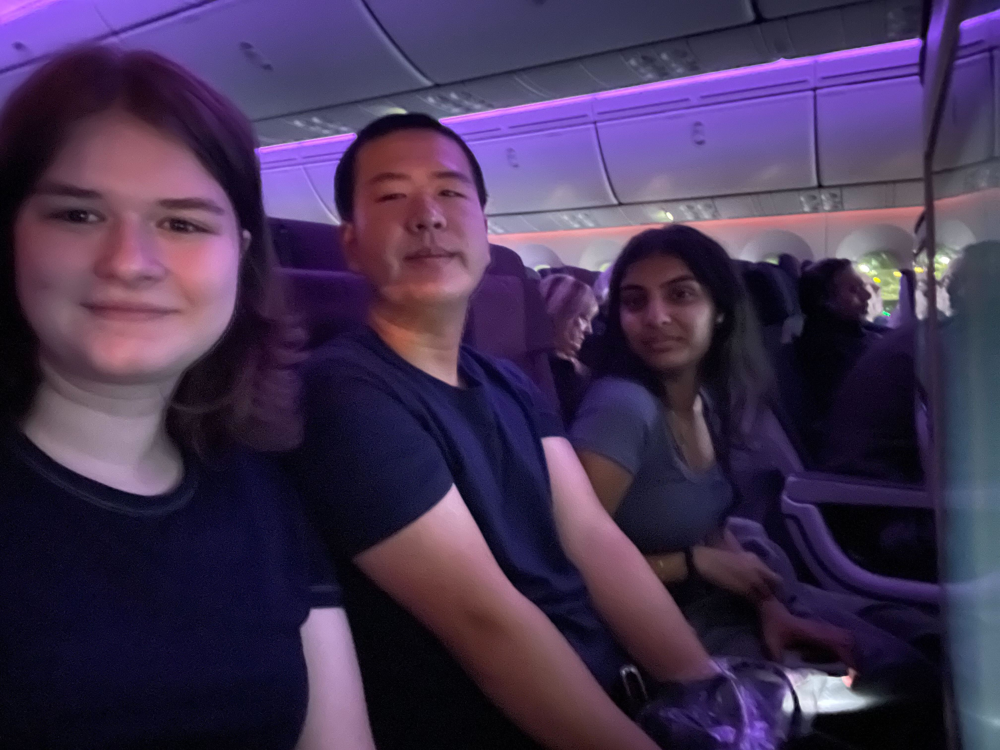
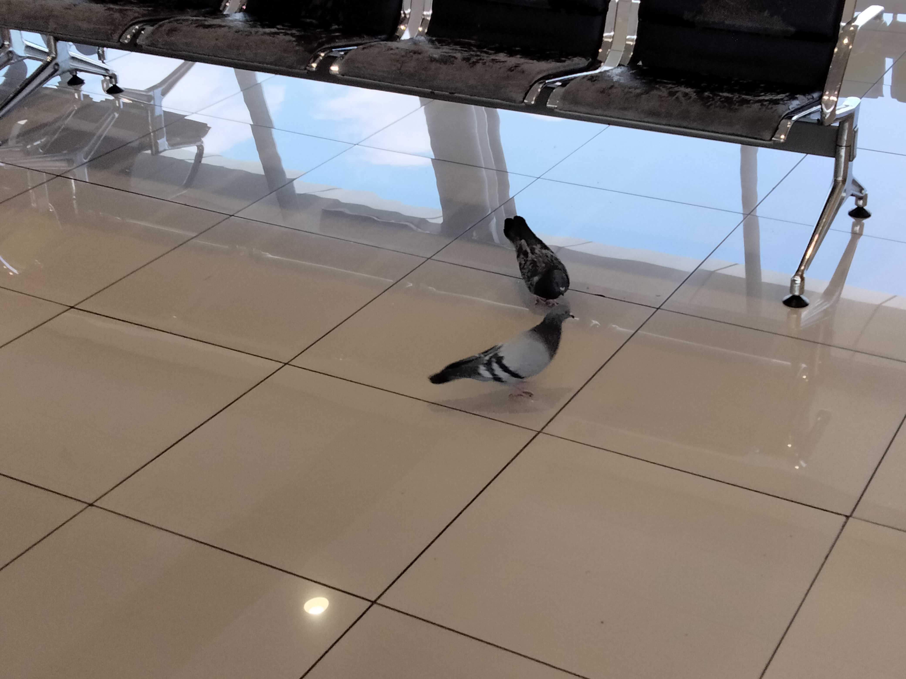

# Botswana Blog - 2025

## Day -2 (7/10)

3 days 'til we go to the airport!

We're (mostly) packed and ready for the trip. Reviewing last-minute travel requirements, as well as going over the SPIKE Prime robot code one last time, we had our very last Botswana outreach meeting today.

## Days 1, 2, and 3 (7/13 - 7/15)

We all arrived at the airport with enough time to check bags, get through security without issue, and grabbed some overpriced airport food. When we finally sat down on the plane we had to settle in for a long (15-hour) flight.

The first flight lasted over 15 hours, and we were very tired by the time we got to Doha, 24 hours later. We were lucky enough to have a long enough layover before our next flight to get hotel rooms for a quick rest. We stayed for about 6 hours at the Garden Hotel inside the Doha airport — getting some much-needed, if short, sleep — and got up at midnight to catch our next flight to Johannesburg.

We are currently writing this from the Johannesburg OR Tambo International Airport in South Africa, after an 8-hour flight from Doha. Hanging out in the terminal with us are pigeons. We aren't sure how they got here, but we appreciate the company.

### Edit from Day 4 (7/16):

We had approximately one hour left of flying before we get to the Sir Seretse Khama International Airport, named after the first president of Botswana.

Exhausted but excited, we stayed up until 9:00 PM in order to combat jet lag and get ourselves set up better for the next two weeks.

## Day 4 (7/16)

Everyone woke up at different times today, so we had a nice, chill morning, and we all had fun on our breakfast adventures. Eric and Rob woke up early for a morning run, while Emlyn and Bharvi woke up around 9:00. Everyone starting trickling into the breakfast area where we debated what constituted a sandwich versus a toast, Bharvi made her morning chai, and Eric attempted to flip an egg without a spatula... (spoiler alert - it didn't go well!) 

After breakfast and showers, we were informed that we needed to build a FLL field for the cultural exhange we have tomorrow. The rest of our morning went by with Eric doing some coding, the rest of us building various LEGO model missions, and Heidi writing a bio for her speech tomorrow. It started out theraputic, but we ended up with only 3 missons complete before it was time for lunch. 

