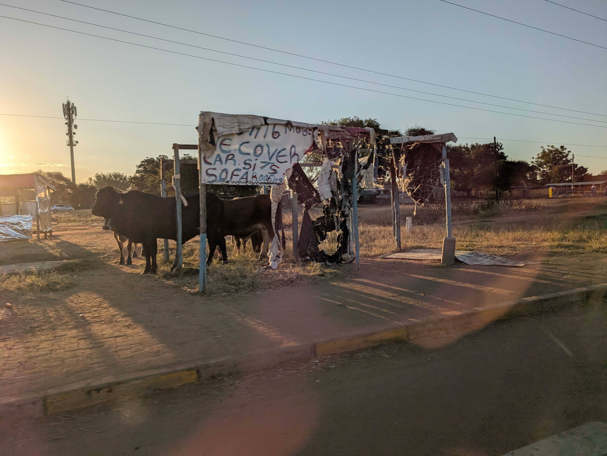

# Botswana Blog - 2025

## Day -2 (7/10)

3 days 'til we go to the airport!

We're (mostly) packed and ready for the trip. Reviewing last-minute travel requirements, as well as going over the SPIKE Prime robot code one last time, we had our very last Botswana outreach meeting today.

## Days 1, 2, and 3 (7/13 - 7/15)

We all arrived at the airport with enough time to check bags, get through security without issue, and grabbed some overpriced airport food. When we finally sat down on the plane we had to settle in for a long (15-hour) flight.

The first flight lasted over 15 hours, and we were very tired by the time we got to Doha, 24 hours later. We were lucky enough to have a long enough layover before our next flight to get hotel rooms for a quick rest. We stayed for about 6 hours at the Garden Hotel inside the Doha airport — getting some much-needed, if short, sleep — and got up at midnight to catch our next flight to Johannesburg.

We are currently writing this from the Johannesburg OR Tambo International Airport in South Africa, after an 8-hour flight from Doha. Hanging out in the terminal with us are pigeons. We aren't sure how they got here, but we appreciate the company.

### Edit from Day 4 (7/16):

We had approximately one hour left of flying before we get to the Sir Seretse Khama International Airport, named after the first president of Botswana.

Exhausted but excited, we stayed up until 9:00 PM in order to combat jet lag and get ourselves set up better for the next two weeks.

## Day 4 (7/16)

Everyone woke up at different times today, so we had a nice, chill morning, and we all had fun on our breakfast adventures. Eric and Rob woke up early for a morning run, while Emlyn and Bharvi woke up around 9:00. Everyone starting trickling into the breakfast area where we debated what constituted a sandwich versus a toast, Bharvi made her morning chai, and Eric attempted to flip an egg without a spatula... (spoiler alert - it didn't go well!) 

After breakfast and showers, we were informed that we needed to build a FLL field for the cultural exhange we have tomorrow. The rest of our morning went by with Eric doing some coding, the rest of us building various LEGO model missions, and Heidi writing a bio for her speech tomorrow. It started out theraputic, but we ended up with only 3 missons complete before it was time for lunch.  

For lunch we enjoyed a nice meal at a restaurant in the local mall before heading to a small grocery store to pick up some food for lunch tomorrow. We saw an automatic bread slicer!

We then went back to the AirBNB to do even more LEGO building and SPIKE Prime robot coding before heading out to a nice dinner with Heidi's cousin — the top lawyer in Botswana! — and his wife (this was also at the mall).

Just for funsies, Bharvi and Emlyn tried some mocktails, and so did Heidi, but of course Emlyn didn't know this when Heidi first offered her to try her drink, and she was rather concerned. One of us actually had a fun drink at lunch called "Malawi Shandy" which was a combination of lemonade and "Stoney", a popular and very strong ginger beer in Botswana, and it was throughly enjoyed.

All tired, we drove home to bed, but not before finishing the last of the LEGO work.

## Day 5 (7/17)

The morning started off slow again today with people trickling in as they woke up. Eric and Rob went for a morning run, while Heidi walked, and Sara, Emlyn, Hank, and Bharvi held down the fort at the AirBNB. Since we had to leave at noon, the morning was spent grazing as there wasn't much time to get lunch and we had plenty of food from the store. The morning was also spent — somewhat frantically — coding the robot for the cultural exchange later.

We left just after noon for the cultural exchange event, stopping at the Dare to Dream office first to go over plans. We then drove to the Mogoditshane Senior Secondary School, a upper-ages high-school equivalent, but we also had younger students visiting from the other Mogoditshane Junior Secondary School campus. Of these schools' 1,800 students, we met with around 55 of them in their auditorium. The cultural exchange event began with some speeches, from the schools' leadership, from Dare to Dream founder Captain Kgomotso Phatsima, and even from our very own Heidi. Afterwards, we were treated to a traditional dance. We learned later that this was the group's first time performing the dance, but you would never have been able to tell that it was because they seemed so confident and well-rehearsed. Afterwards, we began to talk with the students. While at first everyone was nervous, since we and the students of Mogoditshane Senior and Junior Secondary School were quiet with nerves, eventually we all got more comfortable and the conversation began to flow.

First, we ran through the basics of FLL robotics: the game, the innovation project, and core values. We made sure to emphasize that in FIRST, robotics is more than just technical skills: it is about leadership, communication, and so much more. The students seemed interested in the program, asking loads of questions about what coding language we used and how the game worked.

After going over FLL, we wanted to learn more about each other's cultures. At first we had group question time, where they asked us questions about America, the school system, the culture, and the weather. The students seemed amazed when we revealed that we were only 15-18 years old and not in our 20s like they expected or thought we were. On the other hand, we asked about their school system, their traditions, and much more. We bonded over our shared experieces of the joys of math in school and were baffled by each other's weather (although Fahrenheit-Celsius conversions had to be made).

We then split up to talk to smaller groups, opening up for questions people were too shy to ask in person. Many photos were taken and many questions were asked. Some students stayed an extra 30+ minutes just to ask more questions. Eric was able to go over his code in more depth, even demonstrating Python and more complex coding aspects, while Emlyn fielded more questions about life in America, universities, and leadership. Hank and Bharvi worked together, further explaining the FLL program and spreading the joy of robotics.

Exhausted, we loaded back into the van and went to dinner. While traveling, we saw cows!

Bharvi was desperate for food other than just hamburgers and fries (honestly, we all were), and so we found a restaurant with a wide variety of food including curry, paneer, ribs, kebab, and so much more, which everyone was able to enjoy. Bharvi enjoyed the food a lot, but not enough to stay awake, accidentally falling asleep at the table. It was possibly a food-induced coma, or maybe it was just from the day's hard work.

