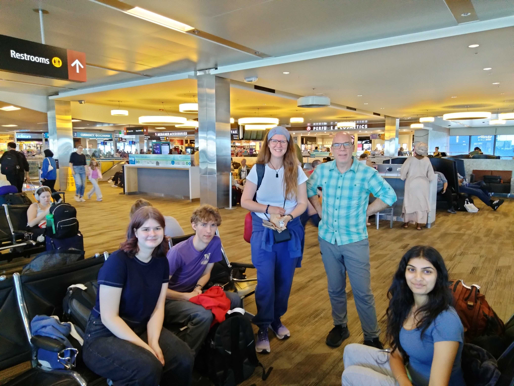

# Botswana Blog - 2025

## Day -2 (7/10)

3 days 'til we go to the airport!

We're (mostly) packed and ready for the trip. Reviewing last-minute travel requirements, as well as going over the SPIKE Prime robot code one last time, we had our very last Botswana outreach meeting today.

## Days 1, 2, and 3 (7/13 - 7/15)

We all arrived at the airport with enough time to check bags, get through security without issue, and grabbed some overpriced airport food. When we finally got sat on the plane we had to settle in for a long (15 hours) flight.

The first flight lasted over 15 hours, and we were very tired by the time we got to Doha, 24 hours later. We were lucky enough to have a long enough layover before our next flight to get hotel rooms. We stayed for about 6 hours at the Garden Hotel — getting some much needed, if short sleep — and got up at midnight to catch our next flight to Johannesburg.

We are currently writing this from the Johannesburg OR Tambo International Airport in South Africa, after an 8 hour flight from Doha. Hanging out in the terminal with us are pigeons.

We still have approximately one hour left of flying before we Gabarone. We plan to stay up until 9:00 PM in order to combat jet lag.